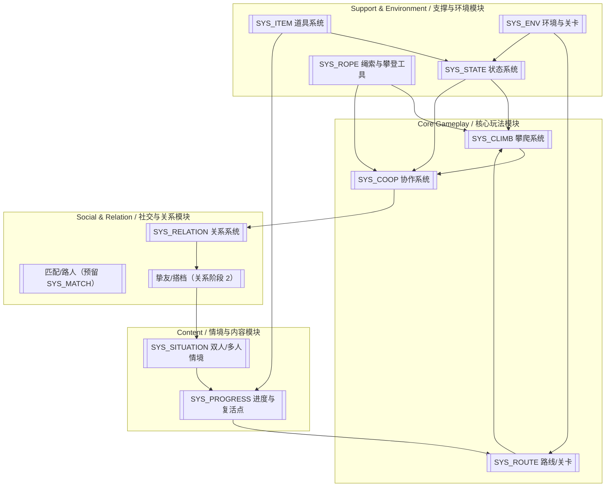
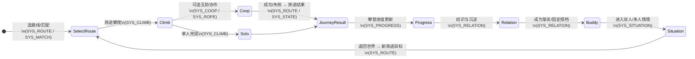

# 梦山 System Architecture / 系统架构白皮书

> **文档状态**: Draft
> **核心依赖**: 基于 `02_Pillars_设计支柱.md` 与 `03_Loops_核心循环.md`。

---

## 1. 架构总览 (Executive Summary)

### 1.1 设计目标 (Design Goal)
*   **体验目标**: 支撑「旅途攀爬 → 互助协作 → 结识挚友 → 双人/多人情境」的闭环。
*   **复杂度控制**: 核心玩法（攀爬+协作）优先；社交与情境模块围绕「固定的人」与「一起做事」展开，避免系统堆砌。

### 1.2 系统拓扑图 (System Landscape)

---

## 2. 核心循环映射 (Core Loop Mapping)

| 循环步骤 (Step) | 关键行为 (Action) | 支撑系统 (Primary Systems) |
| :--- | :--- | :--- |
| **1. 目标** | 选路线、组队/匹配 | 路线/关卡、匹配系统 |
| **2. 挑战** | 攀爬、托举/拉拽/借力 | 攀爬系统、协作系统 |
| **3. 奖励** | 到达检查点、情感反馈 | 关卡进度、关系系统 |
| **4. 成长** | 挚友、解锁情境 | 关系系统、双人/多人情境 |

---

## 3. 系统生态详述 (System Ecology)

### 3.1 [MOD_CORE] 核心玩法模块
> **Design Pillar**: 互助即玩法

*   **[SYS_CLIMB] 攀爬系统** (P0)
    *   **Loop Role**: Challenge（核心操作）
    *   **Input**: 路线配置、支点与障碍
    *   **Output**: 位移、状态、成败反馈
    *   **Feature Scope**: 基础攀爬、支点/借力判定；❌ 纯自动寻路登顶

*   **[SYS_COOP] 协作系统** (P0)
    *   **Loop Role**: Challenge + Reward（互助行为产生结果与关系）
    *   **Input**: 多人状态、托举/拉拽/借力输入
    *   **Output**: 协作成败、情感反馈（关系权益由玩家消耗资源解锁，非协作产出）
    *   **Feature Scope**: 托举、拉拽、借力等明确操作；❌ 仅表情/站桩无玩法结果

*   **[SYS_ROUTE] 路线/关卡系统** (P0)
    *   **Loop Role**: Goal + Source（定义旅途与进度）
    *   **Input**: 关卡配置
    *   **Output**: 攀登进度、情境解锁条件
    *   **Feature Scope**: 单段登山、检查点；**双人必过节点仅出现于隐藏/分支/双人情境，不在主线**；❌ 单人可完全替代协作

### 3.2 [MOD_SOCIAL] 社交与关系模块
> **Design Pillar**: 双人/多人情境是长期锚点

*   **[SYS_RELATION] 关系系统** (P0)
    *   **Loop Role**: Growth
    *   **Input**: 互助行为、共同完成
    *   **Output**: 挚友/搭档、情境解锁权益
    *   **Feature Scope**: 陌生人→挚友进度、固定搭档；❌ 纯数值战力关系

*   **[SYS_SITUATION] 双人/多人情境** (P1)
    *   **Loop Role**: Goal & Growth
    *   **Input**: 挚友关系、攀登进度
    *   **Output**: 专属情境内容与记忆点
    *   **Feature Scope**: 仅双人/小队可进入的关卡与情境；❌ 单人可替代

### 3.3 [MOD_ECONOMY] 经济与表现
> **Design Pillar**: 情感优先于数值

*   **Demo 阶段**: 无需过度考量经济系统。
*   **正式版**: 经济系统为重要模块，待细化；**边界**：仅限外观、便捷、非核心；📤 不产出攀爬/协作数值优势；📥 不设 Pay-to-Win 消耗。

### 3.4 支撑与环境系统补充

*   **[SYS_STATE] 状态系统** (P0)
    *   **Loop Role**: Challenge（风险与失败条件支撑）
    *   **Priority**: P0
    *   **Input**: 来自「环境与关卡」施加的环境占段（寒冷/中毒/受伤等）、来自「道具系统」的状态变更效果、来自「攀爬与移动」「协作与救援」的体力消耗与受挫事件。
    *   **Output**: Action_Bar 可用体力、各类状态占段（负重/饥饿/受伤/中毒/寒冷等）、生存状态（存活/待救援/死亡），供「攀爬」「协作」「进度与复活点」等系统读取。
    *   **Feature Scope**: ✅ 体力上限成长、状态占段、生存状态流转；❌ 经济资源结算、关系数值或社交逻辑。

*   **[SYS_ITEM] 道具系统** (P1)
    *   **Loop Role**: Reward / Growth（通过道具提供风险管理与能力扩展）
    *   **Priority**: P1
    *   **Input**: 玩家背包与物品栏配置、当前状态占段与生存状态、关系权限（谁可对谁使用/取物）。
    *   **Output**: 对状态系统的占段增减（回复/解状态）、对负重占段的计算结果（Weight_Penalty）、少量复活类效果触发「进度与复活点」接口。
    *   **Feature Scope**: ✅ 栏位与背包、负重占段计算、道具类别与使用/放入/丢弃规则、Take_Item 与关系门控；❌ 直接产出攀爬/协作数值优势、独立的经济循环。

*   **[SYS_ROPE] 绳索与攀登工具** (P1)
    *   **Loop Role**: Challenge / Cooperation Support（提供协作攀登的工具与风险缓冲）
    *   **Priority**: P1
    *   **Input**: 关系系统提供的系绳权限（需至少「邂逅者」或「同行者」）、关卡中可挂绳表面与锚点配置、道具系统中的绳索/锚点类道具。
    *   **Output**: 新的攀登路径（绳索路径）、多人共绳时的位移与风险联动数据，反馈给「攀爬与移动」与「协作与救援」。
    *   **Feature Scope**: ✅ 系在同一根登山绳索上的行为定义、绳索/锚点等攀登辅助工具与攀爬接口；❌ 匹配/组队逻辑、本身不承载关系阶段与解锁树。

*   **[SYS_PROGRESS] 进度与复活点** (P0)
    *   **Loop Role**: Goal / Growth（决定「走到哪儿了」与「从哪儿重新开始」）
    *   **Priority**: P0
    *   **Input**: 来自「环境与关卡」的检查点与营地/祭坛配置、来自「状态系统」的死亡事件、来自「道具系统」的复活类道具使用。
    *   **Output**: 当前有效的复活点位置、已解锁的检查点进度，用于恢复玩家实体与关卡状态；为内容循环提供「一次旅途」的起点与终点。
    *   **Feature Scope**: ✅ 检查点、营地/祭坛复活、稀有复活道具触发的复活途径与进度保存；❌ 关卡内部的具体机关设计、关系解锁树与经济数值。

*   **[SYS_ENV] 环境与关卡** (P1)
    *   **Loop Role**: Challenge / Goal（提供地形挑战与路线结构）
    *   **Priority**: P1
    *   **Input**: 关卡配置数据（主线/分支/隐藏路段划分）、环境危害参数（寒冷区、毒区、摔落高度等）、来自「进度与复活点」的检查点与营地位置。
    *   **Output**: 对状态系统施加各类环境占段（寒冷/中毒/受伤等）、提供可攀爬斜面与支点给「攀爬与移动」、在隐藏/分支中布置协作节点给「协作与救援」。
    *   **Feature Scope**: ✅ 环境危害施加来源、主线/分支/隐藏路段划分、协作节点与检查点/营地/祭坛在关卡中的落点；❌ 体力与状态数值计算、关系与经济规则。

> **匹配/组队系统说明**：当前版本仅在架构总览中以「匹配/路人」形式出现，尚未单独立项为完整系统；后续若引入正式的匹配/组队机制，将以 **[SYS_MATCH] 匹配/组队系统** 形式单独注册，并补充 Loop Role / Priority / 资源流转等定义。

---

## 3.1 资源流转视图 (Economy & Resource Mapping)

> **说明**：本节是对《04_ResourceFlow_资源流》的结构化引用，从系统架构角度标注「谁产出 / 谁消耗 / 谁承接池」。

| 资源类型 | Source 系统 (产出) | Pool (蓄水池) | Sink / Converter (消耗/转换) | 备注 |
| :--- | :--- | :--- | :--- | :--- |
| 攀登进度 | SYS_ROUTE / SYS_PROGRESS | 攀登进度 | 解锁新路线与情境入口（SYS_ROUTE / SYS_SITUATION） | 单段旅途完成与检查点绑定 |
| 临时增幅（临时翼） | SYS_ROUTE / SYS_ENV | 临时增幅 Pool | 受挫损失（SYS_STATE / 玩法事件）、周目仪式转换为高级货币 | 本周期内的体力/行动上限 |
| 高级货币 | 周目仪式（Content Period） | 高级货币 Pool | 兑换永久增幅与先祖内容 | 不直接参与关系解锁，避免混淆 |
| 永久增幅（永久翼） | 兑换处 / 先祖节点 | 永久增幅 Pool | 无显式消耗，仅作为长期能力 | 不会被玩法事件清空 |
| 通用货币 CANDLE | SYS_ROUTE（旅途完成）、SYS_ENV（探索点）、SYS_SITUATION（情境结算）、运营任务（挂 SYS_ROUTE） | CANDLE Pool | 关系添加与节点解锁（SYS_RELATION）、外观/非核心内容解锁 | 明确禁止购买攀爬/协作数值优势 |
| 关系节点 (RelationUnlockNode) | SYS_RELATION（消耗 CANDLE） | 已解锁关系节点 Pool | 解锁对白可见、系绳、双人情境入口（驱动 SYS_SITUATION） | 不接受协作次数直接输入 |
| 情境/外观解锁 | SYS_RELATION / SYS_ROUTE | 情境/外观解锁 Pool | 情境消耗（一次性或周期性开放）、装扮使用 | 不影响数值强度 |

> **闭环检查**：所有被产出的资源均在上表中有对应的 Sink 或 Converter；目前不存在「有产出无消耗」或「有消耗无产出」的已定义资源。

---

## 4. 支柱验证矩阵 (Pillar Validation)

| 系统 ID | 系统名称 | 互助即玩法 (Pillar 1) | 情感优先于数值 (Pillar 2) | 双人情境锚点 (Pillar 3) | 备注 |
| :--- | :--- | :---: | :---: | :---: | :--- |
| SYS_CLIMB | 攀爬系统 | ✅ 核心操作依赖体力与地形 | - | - | 为协作提供基础动作空间 |
| SYS_COOP | 协作系统 | ✅ 互助即过关手段 | ✅ 利他反馈优先于收益 | ⚪ 间接支撑：为关系与情境提供素材 | 协作本身不产出数值，仅产出情感体验 |
| SYS_ROUTE | 路线/关卡系统 | ✅ 在主线与分支中布置协作节点 | - | ⚪ 间接支撑：通过隐藏/分支承载双人路段 | 主线单人可过，协作集中在隐藏/分支 |
| SYS_STATE | 状态系统 | ⚪ 间接支撑：通过风险与待救援制造互助场景 | - | - | 提供「救援/减负」的风险背景 |
| SYS_ITEM | 道具系统 | ⚪ 间接支撑：互相取物/使用道具形成协作 | ✅ 利他背包与共享资源 | ⚪ 间接支撑：部分道具围绕双人情境设计 | 明确禁止数值 P2W，偏情感与协作便捷 |
| SYS_ROPE | 绳索与攀登工具 | ✅ 共绳与绳路为协作关键手段 | - | ⚪ 间接支撑：双人/多人绳路情境 | 需关系门控后才能共绳 |
| SYS_ENV | 环境与关卡 | ⚪ 间接支撑：通过环境压迫制造互助需求 | - | ⚪ 间接支撑：特定情境环境 | 负责寒冷/中毒/受伤来源与协作节点落点 |
| SYS_PROGRESS | 进度与复活点 | - | - | ⚪ 间接支撑：双人情境的进度与复活锚点 | 负责一次旅途与复活体验，不直接塑造协作 |
| SYS_RELATION | 关系系统 | - | ✅ 资源驱动关系进阶 | ✅ 核心：固定搭档与关系权益 | 陌生人→同行者路径与关系树解锁 |
| SYS_SITUATION | 双人/多人情境 | - | ✅ 情境优先于数值奖励 | ✅ 核心长期锚点 | 双人/小队专属内容与记忆点 |

> 说明：「⚪ 间接支撑」用于标记**不直接承载该支柱的设计规则，但为其它核心系统提供必要的支撑环境/资源**。其中「协作系统」「关系系统」「双人/多人情境」在 Pillar 3 上为**明确支撑**，是双人情境锚点的主干。

---

## 5. 开发规划 (Development Roadmap) — Demo 相关

| 优先级 | 系统名称 | 依赖项 | 预计版本 | 备注 |
| :--- | :--- | :--- | :--- | :--- |
| P0 | 攀爬原型 | 角色与场景 | Demo | 可玩片段给投资人/团队 |
| P0 | 协作原型 | 攀爬 + 双人 | Demo | 托举/拉拽至少一种 |
| P0 | 单段路线 | 攀爬+协作 | Demo | 一段「必须协作才能过」的体验 |
| P1 | 关系树与解锁展示 | 关系系统 | Alpha 后 | Demo 可仅展示「结识」概念 |
| P1 | 双人情境 | 关系系统 | Beta | 中后期 |

---

## 6. 生态健康度检查 (Ecological Health Check)

> 对应系统架构师职责中的「断路检测 / 支柱 coverage / 循环闭合」自检。

### 6.1 断路检测 (Broken Link Audit)

**已定义资源的 Source ↔ Sink 对照**（简要摘自 3.1）：

- **攀登进度**  
  - Source: `SYS_ROUTE` / `SYS_PROGRESS`（旅途完成、检查点解锁）  
  - Sink/使用: 解锁新路线与情境入口（`SYS_ROUTE` / `SYS_SITUATION`）  
  - 结论: ✅ **闭环**，无「只涨不消费」的进度。

- **临时增幅（临时翼）**  
  - Source: 探索/收集（`SYS_ROUTE` / `SYS_ENV`）  
  - Sink: 受挫损失（`SYS_STATE` / 玩法事件）、周目仪式转换为高级货币  
  - 结论: ✅ **闭环**，存在自然损耗与周期性清空。

- **高级货币**  
  - Source: 周目仪式 / 献祭  
  - Sink: 兑换永久增幅与先祖内容  
  - 结论: ✅ **闭环**，无囤积即废弃的状态。

- **永久增幅（永久翼）**  
  - Source: 兑换处 / 先祖  
  - Sink: 无直接消耗，仅作为长期能力池  
  - 结论: ⚪ **长期池**，不需要 Sink，但需在数值设计中控制成长上限。

- **通用货币 CANDLE**  
  - Source: 单段旅途完成、探索事件、双人/多人情境结算、周期任务  
  - Sink: 添加好友、解锁关系节点、外观/非核心内容解锁  
  - 结论: ✅ **闭环**，且 Source 分布在单人与协作路径上，避免单一刷金点。

- **关系节点 (RelationUnlockNode)**  
  - Source: 消耗 CANDLE 进行解锁（`SYS_RELATION`）  
  - Sink/使用: 解锁对白可见、系绳、双人情境入口等权益  
  - 结论: ✅ **闭环**，权益均有明确使用场景。

> 当前版本未发现需要立即处理的「有产出无消耗」或「有消耗无产出」资源节点；后续新增资源时需同步更新 3.1 与本小节。

### 6.2 支柱 coverage (Pillar Coverage)

结合第 4 节支柱验证矩阵，概览如下：

- **Pillar 1「互助即玩法」**  
  - 强支撑: `SYS_CLIMB`、`SYS_COOP`、`SYS_ROUTE`  
  - 间接支撑: `SYS_STATE`（风险与待救援）、`SYS_ITEM`（利他背包）、`SYS_ROPE`（共绳与绳路）、`SYS_ENV`（环境压迫与协作节点落点）  
  - 结论: ✅ 支柱 1 在核心玩法模块与支撑模块中均有覆盖。

- **Pillar 2「情感优先于数值」**  
  - 强支撑: `SYS_COOP`（利他反馈）、`SYS_RELATION`（资源驱动关系进阶）、`SYS_SITUATION`（情境优先）  
  - 间接支撑: `SYS_ITEM`（限制为外观与便捷、协作便捷）、`SYS_ECONOMY`（正式版边界）  
  - 结论: ✅ 已显式禁止 P2W，经济相关系统均围绕情感与便捷设计。

- **Pillar 3「双人/多人情境是长期锚点」**  
  - 强支撑: `SYS_RELATION`（固定搭档与关系树）、`SYS_SITUATION`（双人/多人情境）、`SYS_PROGRESS`（情境相关进度与复活锚点）  
  - 间接支撑: `SYS_COOP`、`SYS_ROUTE`、`SYS_ENV`、`SYS_ITEM`、`SYS_ROPE`（为双人情境创造素材与环境）  
  - 结论: ✅ 三大支柱中，Pillar 3 由「关系 + 情境 + 进度」三条主干共同承载，长期锚点明确。

### 6.3 循环闭合图 (Loop Closure Diagram)

> 基于《03_Loops_核心循环》中的循环图，在本处以系统 ID 的视角重绘一次，用于架构侧对齐。

> 结论：从「选路线 → 攀爬/协作 → 结识与关系 → 双人/多人情境 → 新目标」形成完整闭环；`SYS_MATCH` 目前仅作为入口预留，不影响循环成立。
