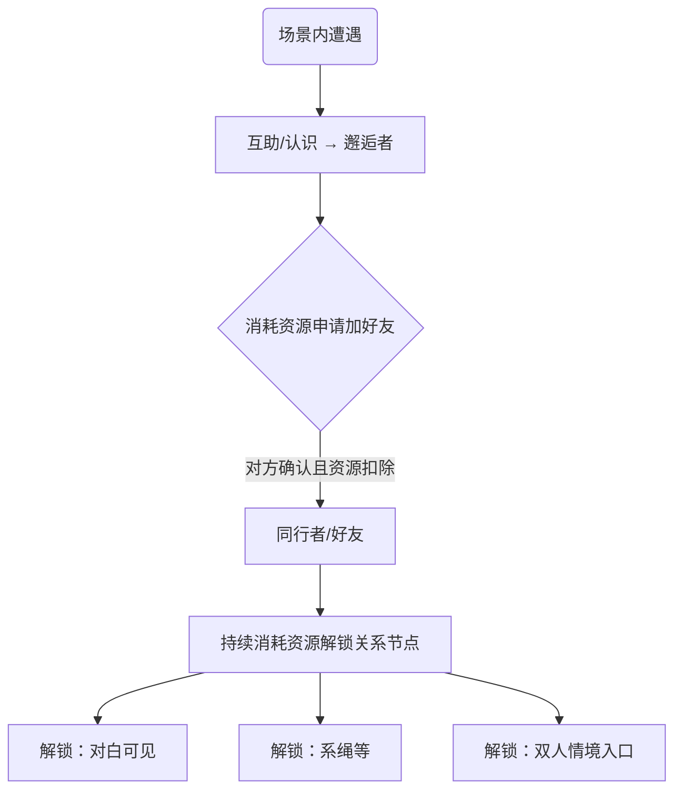

# 梦山 系统设计规范 — 关系系统 (Relation System Spec)

> **设计目的 (Design Goal)**
> *   **体验目标**: [Aes: Belonging] 通过「陌生人→好友→持续投入解锁」的关系路径，形成类似光遇的社交节奏：**需要消耗资源添加好友，并持续投入资源才能开启对白可见、双人情境等新功能**，不依赖好感度积累。
> *   **功能目标**: 管理玩家间关系状态、**资源消耗驱动的添加好友与解锁节点**（如对白可见、双人情境入口），以及关系一致性。
> **设计支柱引用**: [双人/多人情境是长期锚点](../00_项目核心/02_Pillars_设计支柱.md)
> **更新日期**: 2026-02-09

---
## 1. 逻辑架构 (Logical Architecture)

### 1.1 设计原则 (Design Principles)

*   **关系一致性 (Relation Consistency)**  
    玩家彼此间的关系**一定一致**，即不存在「我认为你是我的「好友」，而你却显示我是你的「陌生人」」。双方对同一对关系的状态判定必须一致。

### 1.2 关系状态定义 (Relation State Definition)

以下状态为系统内部状态，**命名不需要呈现给玩家**，仅用于逻辑与配置。

| 状态码 | 内部名称 | 说明 | 表现与约束 |
| :--- | :--- | :--- | :--- |
| **0** | 陌生人 | 通过分配机制在场景中遭遇的其他无交集玩家，通常仅显示统一的默认人物形象（类似光遇）。 | 无 Avatar，无碰撞。 |
| **1** | 邂逅者 | 通过「互助」行为或特定的「认识」行为后，角色形象清晰呈现在彼此眼中。**仅在当前时间/场景框架内生效。** | 呈现 Avatar，有碰撞。成为 1 后，玩家可主动「告别」，使之回退到 0。 |
| **2** | 同行者 | **通过消耗资源完成添加-确认**后，成为彼此好友列表中的玩家。成为好友后，**互相看到对白**等权益由「已解锁的关系节点」决定。 | 成为 2 之后，**无法回退到 0 和 1**，但可以变为 3。后续功能（对白可见、系绳、双人情境等）需**持续消耗资源**在关系树上解锁，**不依赖好感度积累**。 |
| **3** | 异路者 | 通过屏蔽、举报等行为投诉过的玩家，会尽量在匹配机制中规避。 | 可在黑名单内进行移除操作，回归到进入 3 前的原状态。 |

### 1.3 核心对象 (Core Objects)
*   **关系 (Relation)**:
    *   **生命周期**: 陌生人(0) → 邂逅者(1) → [消耗资源添加好友] → 同行者(2) → [可选] 异路者(3)；邂逅者可告别回退至 0；异路者可移除回归原状态。
    *   **关键属性**: 关系双方 ID、关系状态码(0/1/2/3)、**已解锁节点 ID 列表**（决定对白可见、双人情境等权益）、添加/解锁时消耗的资源记录

*   **关系阶段 (Relation Stage)**（与状态码对应）:
    *   **0 陌生人**: 场景分配遭遇，无 Avatar、无碰撞；**无法看到对方对白**。
    *   **1 邂逅者**: 单次场景内互助/认识，有 Avatar、有碰撞，可告别回退；**仍无法看到对方对白**，除非已为 2 且解锁对白节点。
    *   **2 同行者**: **已消耗资源添加好友**；可组队、查看状态。**对白可见、系绳、双人情境等由「关系解锁树」上的已解锁节点决定**，每解锁一项均需消耗资源（类似光遇）。
    *   **3 异路者**: 屏蔽/举报后，匹配规避；黑名单可移除恢复

### 1.4 数据结构 (Data Schema)

```typescript
// 玩家关系数据（双方存储一致，保证关系一致性）
interface RelationData {
    id: string;              // 关系ID (playerA_id + playerB_id 有序)
    playerA: number;         // 玩家A ID
    playerB: number;         // 玩家B ID
    state: RelationState;    // 0陌生人 | 1邂逅者 | 2同行者 | 3异路者
    unlockedNodeIds: number[];  // 已解锁的关系树节点ID（对白可见、双人情境等），由消耗资源解锁
    lastCooperateTime?: number;  // 最近一次协作时间戳（可选，用于展示/统计，不参与解锁逻辑）
    sceneFrameId?: string;   // 邂逅者(1) 仅在当前时间/场景框架内生效时的场景标识
}

/** 关系状态：内部使用，命名不呈现给玩家 */
enum RelationState {
    Stranger = 0,   // 陌生人
    Encounter = 1,  // 邂逅者
    Companion = 2,  // 同行者（已消耗资源添加的好友）
    Avoided = 3     // 异路者
}
```

### 1.5 流程图 (Flowchart)



### 1.6 交互细节 (Interaction Design)
*   **添加好友**：一方发起「加好友」并**消耗指定资源**（如游戏内货币/道具，见配置表）；对方确认后，资源扣除，双方 state 置为 2（同行者）。**未消耗资源或资源不足时无法完成添加**。
*   **对白可见**：成为同行者(2) 后，**仅当双方已解锁「对白可见」关系节点时**，彼此才能看到对方发出的对白；未解锁前与陌生人/邂逅者一致，不显示对方对白。
*   **持续投入解锁**：在好友关系树上，每一档权益（如对白可见、系绳、某双人情境入口）对应一个**关系节点**；玩家需**对该关系消耗资源**才能解锁该节点，解锁后双方永久享有该权益。**不依赖一起游玩或协作次数**，仅依赖资源投入（类似光遇蜡烛/爱心解锁树）。
*   **反馈表现**:
    *   **视觉**: 关系阶段图标、关系树已解锁节点、解锁时的演出
    *   **听觉**: 加好友/解锁节点时的提示音
    *   **触觉**: [可选] 解锁节点时的震动反馈

---
## 2. 原子规则 (Atomic Rules)

### 规则 0: 关系一致性 (Relation Consistency)
*   **级别**: **必须 (MUST)**
*   **触发**: 任意一方关系状态变更时
*   **检查**: 双方服务器/客户端数据可用
*   **执行**: 将新状态**同步写入**关系双方的数据；双方对同一对关系的 state 必须一致。
*   **异常**: 同步失败时回滚或重试，严禁出现双方状态不一致

### 规则 1: 邂逅与告别 (Encounter & Farewell)
*   **级别**: **必须 (MUST)**
*   **触发**: 互助/认识行为成功 → state 置为 1（邂逅者）；玩家主动「告别」→ state 回退为 0（陌生人）
*   **检查**: 邂逅者(1) 仅在当前时间/场景框架内生效；告别仅当 state === 1 时允许
*   **执行**: 0↔1 仅在当前场景有效；写入时带 sceneFrameId；告别后清除 Avatar、碰撞
*   **异常**: 跨场景/跨会话后邂逅者自动视为失效（按 0 处理），除非已升为 2

### 规则 2: 消耗资源添加好友
*   **级别**: **必须 (MUST)**
*   **触发**: 一方发起「加好友」并选择消耗资源；对方确认
*   **检查**: 发起方拥有足够资源（见配置表）；双方 state 为 0 或 1；双方确认
*   **执行**: 扣除发起方资源；双方 state 置为 2（同行者）；关系数据同步双方
*   **反馈**: 加好友成功演出；若配置了「添加即解锁对白」，则写入 unlockedNodeIds
*   **异常**: 资源不足时无法发起或完成；重复加好友请求忽略，保持 2

### 规则 3: 消耗资源解锁关系节点
*   **级别**: **必须 (MUST)**
*   **触发**: 玩家对某段关系选择「解锁某节点」（如对白可见、系绳、某双人情境入口）
*   **检查**: 双方已是同行者(2)；该节点未解锁；玩家拥有节点所需资源（见 RelationUnlockNode 表）
*   **执行**: 扣除资源；将节点 ID 写入该关系的 unlockedNodeIds；双方同步
*   **反馈**: 解锁演出、对应权益立即可用（如对白可见、情境入口高亮）
*   **异常**: 资源不足时不可解锁；若一方解除好友，该关系及所有已解锁节点权益失效

### 规则 4: 双人情境进入条件
*   **级别**: **必须 (MUST)**
*   **触发**: 进入双人/多人情境
*   **检查**: 双方为同行者(2)；该情境对应的关系节点已解锁（unlockedNodeIds 含该情境节点）；双方在线
*   **执行**: 进入情境实例；消耗入场资格（若设计需要）
*   **反馈**: 情境加载、双人演出
*   **异常**: 对方离线时提示「等待搭档上线」；未解锁该情境节点时入口灰显或提示「需在关系树中解锁」

### 规则 5: 异路者与移除 (Avoided & Unblock)
*   **级别**: **必须 (MUST)**
*   **触发**: 屏蔽/举报等行为 → state 置为 3（异路者）；在黑名单内执行移除 → 回归进入 3 前的原状态
*   **检查**: 匹配机制需查询 state，对 3 尽量规避；移除仅允许在黑名单/屏蔽列表界面操作
*   **执行**: 进入 3 时记录 previousState；移除时恢复 previousState，并同步双方
*   **异常**: 若原状态为 1（邂逅者），恢复后因场景可能已失效，按 0 处理

---
## 3. 依赖与接口 (Dependencies)

### 3.1 外部依赖
*   依赖 **[道具/资源系统]**: 添加好友与解锁节点时扣除资源（资源类型与数量见配置表）
*   依赖 **[双人情境]**: 情境进入前检查该关系是否已解锁对应情境节点

### 3.2 对外接口
*   提供给 **[匹配系统]**: `GetCompanionList(playerId)` — 获取同行者（好友）列表用于组队
*   提供给 **[情境系统]**: `HasUnlockedSituation(playerA, playerB, situationId)` — 检查双方是否已解锁该情境节点
*   提供给 **[UI]**: `GetRelationStage(playerA, playerB)` — 展示关系状态；`GetUnlockedNodes(relationId)` — 展示已解锁节点（对白可见、情境等）
*   提供给 **[对白/聊天]**: `CanSeeDialogue(playerA, playerB)` — 是否已解锁「对白可见」节点（同行者且节点已解锁时 true）

---
## 4. 内容需求 (Content Requirements)

### 4.1 配置表 (Config Tables)

**表名**: `RelationUnlockNode`（关系解锁树节点，类似光遇好友树）

| 字段名 | 类型 | 分类 | 说明 | 验证规则 |
| :--- | :--- | :--- | :--- | :--- |
| ID | int | 🔑 Key | 节点ID | Unique, >0 |
| NodeName | string | 📝 Text | 节点名称键 | Ref(Localization) |
| ResourceType | string | 🔑 Key | 消耗资源类型 | 如 currency / item_id |
| ResourceAmount | int | 🔢 Num | 消耗数量 | >0 |
| EffectType | string | 📝 Enum | 解锁后权益类型 | DIALOG_VISIBLE / ROPE / SITUATION 等 |
| EffectParam | string | 📝 | 权益参数（如情境ID） | 可选 |
| ParentNodeId | int | 🔢 Num | 前置节点ID（0=无前置） | 可选，表示需先解锁该节点 |

**表名**: `AddFriendCost`（添加好友所需消耗）

| 字段名 | 类型 | 分类 | 说明 | 验证规则 |
| :--- | :--- | :--- | :--- | :--- |
| ResourceType | string | 🔑 Key | 资源类型 | 如 currency / item_id |
| Amount | int | 🔢 Num | 数量 | >0 |

### 4.2 数值与逻辑说明

*   **不设好感度/信任度**：关系进阶与权益**仅由「是否消耗资源完成添加」与「是否消耗资源解锁某节点」**决定，协作次数不直接解锁功能。
*   **对白可见**：建议配置为关系树上首个或独立节点，解锁后双方可见对方对白；未解锁时与陌生人/邂逅者一致，不显示。
*   **双人情境**：每个情境入口对应一个 RelationUnlockNode，解锁后该关系下可进入该情境。

---
## 5. 异常与边界 (Edge Cases)

| 场景 | 预期行为 | 错误码 |
| :--- | :--- | :--- |
| 关系一致性 | 任一方 state 变更必须同步对方，严禁双向显示不一致 | - |
| 邂逅者跨场景/跨会话 | 状态 1 仅当前场景有效，离开后按 0 处理 | - |
| 主动告别（1→0） | 仅 state=1 时可操作；执行后无 Avatar、无碰撞 | - |
| 同行者(2) 回退 | 不允许回退到 0 或 1，仅可变为 3（异路者） | - |
| 异路者移除 | 仅能在黑名单内操作，恢复为进入 3 前的 previousState | - |
| 断网重连 | 重新拉取关系数据，保持本地缓存 | - |
| 对方解除好友 | 该关系及所有已解锁节点权益收回；state 按产品定义回退或保留为 2 但标记「已解除」 | - |
| 重复加好友 | 忽略，保持同行者(2) 状态 | - |
| 资源不足 | 无法发起添加好友或无法解锁节点；提示资源不足 | - |

---
## 6. 与 PEAK 的差异（梦山保留）

*   **PEAK**：无陌生人/邂逅者/同行者等关系分级；同局队友均可互相访问背上背包、使用道具、救援，无权限门槛。
*   **梦山保留**：关系状态 0/1/2/3 及关系一致性；「谁可对谁 Take_Item、使用综合功效道具、系绳」等均由关系门控决定（见《协作与救援》4.3）。冲突时以梦山关系系统为准。
