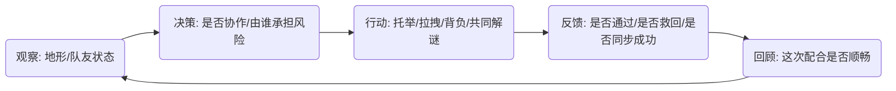

# 梦山 核心玩法规范 — 双人情境 (Core Gameplay — Duo Situations)

> **核心情感体验 (Core Aesthetics)**  
> *   「一起解开的默契感」「一起扛过去的信任感」「一起看风景的归属感」。  
> **设计支柱引用**: [双人/多人情境是长期锚点](../00_项目核心/02_Pillars_设计支柱.md)  
> **关联文档**: 《攀爬与移动》《协作与救援》《环境与关卡》《关系系统》  
> **更新日期**: 2026-02-09

---

## 1. 双人情境类型与体验锚点

> 本节定义 2–3 类核心双人情境的「情感体验」「快感锚点」「阻碍维度」与「核心动词」，为后续具体关卡与系统设计提供锚点。

### 1.1 类型一：共同解谜的默契感

- **核心情感**：在「看懂彼此意图」的瞬间产生的默契与心照不宣。  
- **快感锚点**：  
  - 关键时刻「你想到的正好也是我想到的」；  
  - 通过少量眼神/动作就完成高度配合的解法。  
- **阻碍维度**：  
  - 信息不对称（不同视角/机关信息分散在两人处）；  
  - 时间窗口压力适中（给思考空间，但不能无限拖延）。  
- **核心动词**：  
  - 「观察→交流→同时执行」：例如两人同时踩压机关、交替操作拉杆、轮流托举与拉拽。  

### 1.2 类型二：一起面对未知的信任感

- **核心情感**：在不完全确定结果的前提下，仍愿意把「安全感」托付给对方。  
- **快感锚点**：  
  - 在险境中由队友托举/拉拽/背负，通过危险区域后一起松一口气；  
  - 倒地/负重时被队友救回来，产生「这次真是靠你了」的记忆点。  
- **阻碍维度**：  
  - 体力与负重（背负时移动/攀爬变难，体力被 Weight_Penalty 占段）；  
  - 环境危害（寒冷/中毒等占段叠加在救援路线中）。  
- **核心动词**：  
  - 「背负→撤退/前进→复苏」；  
  - 「拉上去→稳住→继续攀爬」。  

### 1.3 类型三：共享旅途的归属感

- **核心情感**：将长线旅程中的多个片段串联起来，形成「固定的人一起玩」的归属感。  
- **快感锚点**：  
  - 抵达观景点/营地时的「一起看风景」瞬间；  
  - 多次同行后，看到对方上线/靠近时自然形成的期待。  
- **阻碍维度**：  
  - 轻量时间成本（为到达观景点/支线目标而付出的额外路程）；  
  - 软性资源考量（体力、简单道具消耗）。  
- **核心动词**：  
  - 「同行→协作通过小障碍→共享奖励/风景」。  

---

## 2. 体验锚点一览表

| 情境类型 | 核心情感体验（形容词 + 名词） | 快感锚点 | 主要阻碍维度 | 核心动词 |
| :--- | :--- | :--- | :--- | :--- |
| 共同解谜 | 沉默的默契感 | 在有限提示下同时想到同一解法的瞬间 | 信息 / 时间 | 观察、交流、同时执行 |
| 危险救援 | 压力下的信任感 | 在坠落/倒地边缘被队友托起/拉上/背走 | 体力 / 资源 / 环境 | 托举、拉拽、背负、复苏 |
| 旅途同行 | 长线的归属感 | 多次同行后「一起看到风景」的时刻 | 时间 / 轻量资源 | 同行、协作通关、共享奖励 |

> 说明：具体关卡/系统在引用本表时，应明确「本情境主要服务哪一行」，避免在单一节点中同时追求所有情感，导致体验稀释。

---

## 3. 双人情境下的心理循环

### 3.1 标准循环（示意）

- **观察**：  
  - 玩家在看地形支点的同时，会观察队友位置、体力状态、是否处于待救援状态等。  
- **决策**：  
  - 例如「是我去托举还是我先过去拉你？」「是现在救人，还是先清理前方危险？」。  
- **行动**：  
  - 执行托举、拉拽、背负、同时触发机关、对队友使用道具等协作动词。  
- **反馈**：  
  - 通过前文在《攀爬与移动》《协作与救援》中定义的视听触反馈，让玩家明确知道「我们成功/失败了」。  
- **回顾**：  
  - 成功时强化「下次还想和 TA 一起玩」；失败但可重试时，让玩家感觉是「需要再磨合一下」而非「系统不讲理」。

### 3.2 与单人攀爬循环的差异

- 在单人循环中，重点是「路线阅读与操作节奏」；  
- 在双人情境中，循环多了一层「理解队友意图与互相校准」：  
  - 决策阶段不仅考虑地形，还要考虑「谁更熟练」「谁负重更轻」「谁更接近安全点」；  
  - 反馈阶段不仅告诉「是否通过」，还要用视听触手段强调「是因为配合到位」而成功。

---

## 4. 与设计支柱与系统的对齐

- **与设计支柱「双人/多人情境是长期锚点」的关系**：  
  - 本规范中的双人情境类型应在长期内容规划中反复出现，而非一次性 Demo；  
  - 不同赛季/版本可以围绕不同情境类型做主题强化（如某季更强调危险救援，某季更强调共同解谜）。  
- **与系统层规范的连接**：  
  - 具体的托举/拉拽/背负/复苏规则，依托《协作与救援》《状态系统》；  
  - 具体的路线、营地、观景点与协作节点分布，依托《环境与关卡》；  
  - 关系的沉淀（从陌生人到同行者）与长期绑定，依托《关系系统》。  
- **与数值与运营的接口**：  
  - 日志与埋点可围绕「双人情境触发次数」「成功率」「重复组队频率」等指标，用于验证是否真正成为长期锚点。

