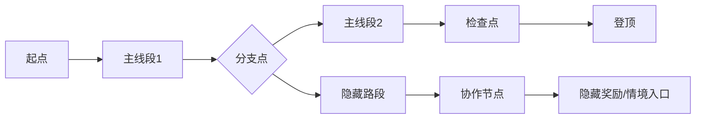

# 梦山 关卡设计规范 — 路线与协作节点 (Level Design Spec)

> **设计原则**: 路线是攀爬的容器，协作节点是关系建立的舞台。主线保证单人可过，隐藏/分支体现协作价值。
> **设计支柱引用**: [互助即玩法](../00_项目核心/02_Pillars_设计支柱.md)
> **更新日期**: 2026-02-07

---

## 1. 空间语法 (Spatial Grammar)

### 1.1 拓扑结构 (Topology)
*   **结构类型**: 线性为主（单段登山）+ 中心辐射（分支/隐藏路段）
*   **节点图 (Node Graph)**:

### 1.2 尺度与氛围
*   **空间尺度**:
    *   **主通道宽度**: 单人可攀爬，约 {{MAIN_WIDTH_M}} 米等效
    *   **协作区域**: 托举/拉拽有效范围约 {{COOP_RANGE_M}} 米
*   **引导语言**: 光照引导主路径；隐藏路段入口偏暗或需绕路；协作节点处有明显「双人脚印/牵手」等环境提示

---

## 2. 节奏切片 (Pacing Slices)

### 2.1 强度曲线 (Intensity Curve)
*   **起点**: 低压（教学/熟悉支点）
*   **中段**: 波浪上升（攀爬 → 小挑战 → 攀爬）
*   **协作节点**: 中高压（需配合，失败可重试）
*   **终点**: 释放（登顶、情感反馈、情境入口）

### 2.2 原子玩法分布 (Gameplay Distribution)
*   **攀爬 (Traversal)**: 约 70% — 单人可完成的主线
*   **协作 (Cooperation)**: 约 20% — 隐藏/分支的协作节点
*   **叙事/氛围 (Narrative)**: 约 10% — 检查点、环境叙事、登顶演出

---

## 3. 路线与协作节点编排

### 3.1 主线路段 (Main Route)
*   **必须 (MUST)**: 主线路段所有节点可单人攀爬通过。
*   **可选增强**: 主线上可设计「协作可加速/捷径」的节点，但非通关前提。
*   **检查点**: 每 {{CHECKPOINT_INTERVAL_MIN}} 分钟或每 {{CHECKPOINT_INTERVAL_NODES}} 个节点设置检查点，失败可从检查点重试。

### 3.2 分支与隐藏路段 (Branch / Hidden)
*   **协作节点**: 隐藏/分支路段可设计「单人难以完成、协作才有解法」的节点。
*   **战术意图**: 每个协作节点必须有明确的协作类型（托举/拉拽/借力）与空间布置。
*   **示例**:
    *   **托举节点**: A 在高处支点，B 在下方；B 需 A 托举才能到达下一支点。
    *   **拉拽节点**: A 在安全平台，B 悬空；A 拉拽 B 至平台。
    *   **借力节点**: 两人同时起跳，在空中借力互相推高，到达单独无法到达的支点。

### 3.3 资源投放
*   **补给点**: 高强度攀爬/协作节点前设置喘息区（可选，若设计体力）。
*   **隐藏奖励**: 协作节点后的隐藏路段可投放情境入口、外观等。

---

## 4. 叙事填充 (Narrative Fills)

*   **环境叙事**: 峭壁上的刻痕、前人留下的绳索，暗示「这里曾有人互助登顶」。
*   **脚本事件**: 到达协作节点时，可触发简短演出（如「需要帮助？」的台词/字幕）；协作成功后「我们一起做到了」的庆祝动画。

---

## 5. Demo 单段路线模板

| 段落 | 时长 | 内容 | 协作需求 |
| :--- | :--- | :--- | :--- |
| 开场 | 1–2 min | 基础攀爬教学、支点熟悉 | 无 |
| 主线段1 | 2–3 min | 线性攀爬，到达分支点 | 无 |
| 分支/隐藏 | 3–5 min | 协作节点（托举或拉拽至少一种） | 必须协作 |
| 主线段2 | 2–3 min | 继续攀爬至登顶 | 无 |
| 登顶 | 1 min | 演出、情境入口提示 | 无 |

---

## 6. 验证清单 (Checklist)

*   [ ] 主线路段可单人通关
*   [ ] 隐藏/分支至少有一个「必须协作才能过」的节点
*   [ ] 协作节点有明确的空间布置与协作类型
*   [ ] 节奏有起伏，协作节点前后有喘息
*   [ ] 符合「温暖、通透、可亲近」的美术基调
