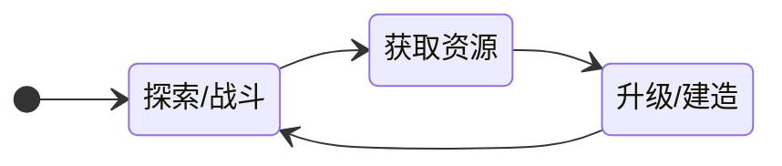

# [Project Name] Core Loops (核心循环)

## 1. Loop Logic (循环逻辑)
> *在此处用文字描述循环逻辑，作为下方图表的文字版兜底。*

## 2. Loop Diagram (循环图)

## 3. Loop Layers & Time Boxing (分层与时间切片)
> *明确每一层循环的标准时长与核心体验。*

### 3.1 Micro Loop (秒级交互)
*   **Time Box**: [0.1s - 5s]
*   **Core Action**: [输入 -> 反馈 -> 结果] (e.g., 瞄准 -> 射击 -> 爆头反馈)
*   **Feel**: [手感关键词，如：爽快、粘滞、厚重]

### 3.2 Mid Loop (单局/任务循环)
*   **Time Box**: [3min - 15min]
*   **Structure**:
    1.  **Prep (准备)**: [选装备/接任务]
    2.  **Action (执行)**: [核心玩法体验]
    3.  **Reward (结算)**: [获取奖励/评分]
*   **Goal**: [玩家在这一层追求什么？e.g., 完成度 S 级]

### 3.3 Macro Loop (长线养成)
*   **Time Box**: [1周 - 3个月]
*   **Structure**: [资源积累] -> [能力解锁] -> [挑战更高难度]
*   **Goal**: [玩家的终极目标是什么？e.g., 全图鉴收集 / 登顶排行榜]

---

## 4. Motivation Drivers (驱动力分析)
> *玩家为什么要不断重复上述循环？*

| 循环层级 | 驱动力 (Driver) | 心理学机制 (Psychology) |
| :--- | :--- | :--- |
| **Micro** | 肾上腺素 / 掌控感 | 只有精准操作才能获得的即时快感 (Mastery) |
| **Mid** | 探索欲 / 贪婪 | 未知宝箱带来的随机奖励 (Variable Reward) |
| **Macro** | 社交地位 / 完满感 | 独一无二的外观或全收集成就 (Social Proof / Ownership) |
