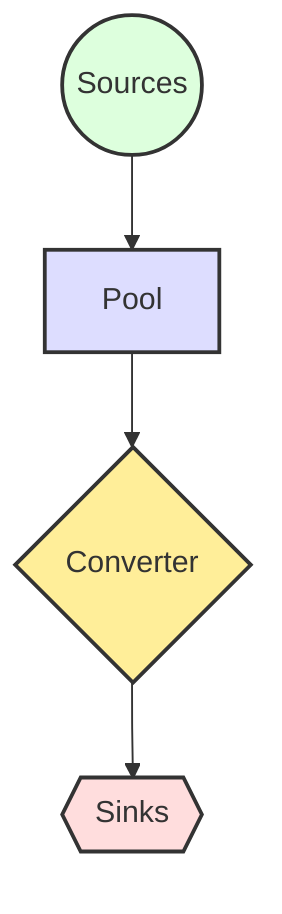

# [Project Name] Resource Flow (资源流)

## 1. Flow Logic (流向逻辑)
> *在此处用文字描述资源流向，作为下方图表的文字版兜底。*

## 2. Flow Chart (流向图)

## 3. Machinations Model (系统动力学模型)

### Sources (源 / 龙头)
> *资源从哪里凭空产生？*
*   **[Source Name]**: [描述产出逻辑，如：自动恢复、击杀掉落]

### Pools (池 / 蓄水池)
> *资源储存在哪里？*
*   **[Resource Name]**: [描述用途与上限]

### Converters (转换器 / 制作台)
> *资源如何转化为另一种形式？*
*   **[Mechanic Name]**: [Input资源] -> [Output资源/状态] (如：木材 -> 建筑)

### Sinks (汇 / 漏斗)
> *资源在哪里被永久消耗？*
*   **[Sink Name]**: [描述消耗逻辑，如：维修消耗、商店购买]

### Trader (交换 / 市场)
> *玩家间或系统间的交换逻辑。*
*   **[Mechanic Name]**: [交换规则]
