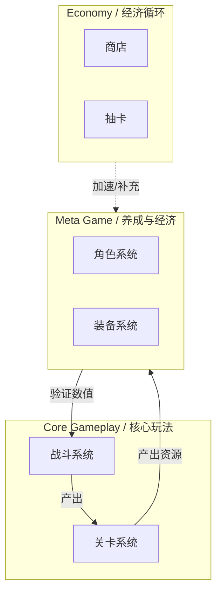

# [Project Name] System Architecture / 系统架构白皮书

> **文档状态**: Draft / Review / Final
> **最后更新**: 202X-XX-XX
> **所属阶段**: 立项/预制作
> **核心依赖**: 必须基于 `02_Pillars_设计支柱.md` 和 `03_Loops_核心循环.md` 编写。

---

## 1. 架构总览 (Executive Summary)

### 1.1 设计目标 (Design Goal)
*简述这套系统架构旨在支撑什么样的核心体验。*
*   **体验目标**: [例如：构建高频的“战斗-获取-强化”循环]
*   **复杂度控制**: [例如：外围系统尽量扁平化，降低理解门槛]

### 1.2 系统拓扑图 (System Landscape)
*使用 Mermaid 展示系统分层结构与核心数据流向。*

---

## 2. 核心循环映射 (Core Loop Mapping)

*将系统映射到游戏的核心循环步骤中，确保每个步骤都有对应的系统支撑。*

| 循环步骤 (Step) | 关键行为 (Action) | 支撑系统 (Primary Systems) |
| :--- | :--- | :--- |
| **1. 目标 (Goal)** | 接任务, 定目标 | 任务系统, 活动面板 |
| **2. 挑战 (Challenge)** | 战斗, 解谜, 匹配 | 战斗系统, 关卡系统, 匹配系统 |
| **3. 奖励 (Reward)** | 结算, 掉落, 领奖 | 掉落系统, 结算流程, 邮件系统 |
| **4. 成长 (Growth)** | 升级, 强化, 搭配 | 角色系统, 装备系统, 天赋系统 |

---

## 3. 系统生态详述 (System Ecology)

> **定义说明**:
> *   **L1 (Module)**: 大的功能模块集合 (e.g., 社交模块)。
> *   **L2 (System)**: 具体的子系统 (e.g., 好友系统)。
> *   **Economy**: 明确资源的 **Source (产出)** 和 **Sink (消耗)**。

### 3.1 [MOD_CORE] 核心玩法模块
> **Design Pillar**: [响应哪个设计支柱？]

*   **[SYS_COMBAT] 战斗系统** (P0)
    *   **Loop Role**: Challenge (验证)
    *   **Input**: 角色属性 (Stats), 技能数据 (Skill)
    *   **Output**: 战斗结果 (Win/Loss), 战斗统计 (Metrics)
    *   **Economy**: [无] (纯逻辑验证)
    *   **Feature Scope (功能边界)**:
        *   ✅ 基础战斗 (普攻/技能)
        *   ✅ 连击系统
        *   ❌ 挂机战斗 (明确禁止)

*   **[SYS_LEVEL] 关卡系统** (P0)
    *   **Loop Role**: Source (产出)
    *   **Input**: 关卡配置 (LevelConfig)
    *   **Output**: 掉落包 (Loot)
    *   **Economy**:
        *   📥 **Sink**: `体力 (Stamina)`
        *   📤 **Source**: `金币 (Gold)`, `经验 (Exp)`, `装备 (Equip)`
    *   **Feature Scope**:
        *   ✅ 线性推图
        *   ✅ 扫荡功能
        *   ❌ 随机生成 (Roguelike)

### 3.2 [MOD_GROWTH] 养成模块
> **Design Pillar**: [响应哪个设计支柱？]

*   **[SYS_HERO] 角色养成** (P0)
    *   **Loop Role**: Growth (成长)
    *   **Input**: 升级道具
    *   **Output**: 属性变更 (Stats Update)
    *   **Economy**:
        *   📥 **Sink**: `金币 (Gold)`, `经验书 (ExpItem)`
        *   📤 **Source**: `战力 (Combat Power)`

### 3.3 [MOD_SOCIAL] 社交模块
> **Design Pillar**: [响应哪个设计支柱？]

*   **[SYS_GUILD] 公会系统** (P1)
    *   **Loop Role**: Goal & Growth
    *   **Economy**:
        *   📥 **Sink**: `钻石 (Gem)` (创建/改名)
        *   📤 **Source**: `公会币 (GuildCoin)`

---

## 4. 支柱验证矩阵 (Pillar Validation)

*检查所有 P0/P1 系统是否都服务于项目支柱。如果一个系统不属于任何支柱，请考虑删除它。*

| 系统 (System) | 支柱 1: [Name] | 支柱 2: [Name] | 支柱 3: [Name] | 备注 |
| :--- | :---: | :---: | :---: | :--- |
| **战斗系统** | ✅ (核心体验) | - | - | - |
| **公会系统** | - | ✅ (社交连接) | - | - |
| **挂机系统** | - | - | ✅ (轻松减负) | - |
| *[某系统]* | ❌ | ❌ | ❌ | **警告**: 考虑移除 |

---

## 5. 开发规划 (Development Roadmap)

| 优先级 | 系统名称 | 依赖项 | 预计版本 | 负责人 |
| :--- | :--- | :--- | :--- | :--- |
| P0 | 战斗原型 | 角色模型 | v0.1 (Demo) | @Combat |
| P0 | 基础养成 | 战斗属性 | v0.2 (Alpha) | @System |
| P1 | 公会基础 | - | v0.3 (Beta) | @Social |
