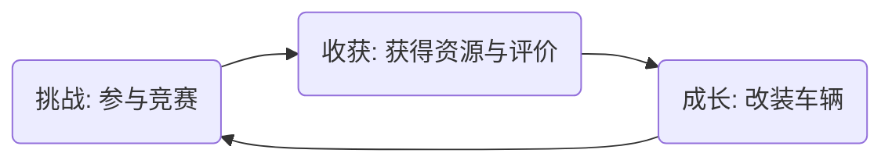

# [游戏名称] Game Concept Document / 游戏概念书

> **前置依赖**: 本文档必须基于已通过验证的《创意验证书》编写。

---

## 1. 顶层定义 (High-Level Definition)

### 1.1 核心体验 (Core Aesthetic)
*   **继承定义**: [在此处粘贴《创意验证书》中的核心定义]
    *   *示例：通过可回溯的竞速玩法，交付掌控命运、消除遗憾的完美主义体验。*

### 1.2 产品愿景 (Product Vision)
用一句话描述游戏最终呈现的样子（Elevator Pitch）。要具体、有画面感，让团队所有成员都能想象出同一个游戏。
*   *示例：一款允许玩家在毫秒间倒转时间的赛博朋克竞速游戏，每一次过弯都是对完美的极致追求。*

---

## 2. 设计支柱 (Design Pillars)

定义 3-4 个不可动摇的设计原则。它们是开发过程中的“宪法”，当团队对设计方向产生分歧时，由支柱决定取舍。

### 支柱 1: [名称]
*   **原则**: [一句话描述]
*   **意味着 (We Do)**: 为了贯彻这个支柱，我们会做什么设计？
*   **不意味着 (We Don't)**: 我们绝不做什么？（反向界定同样重要，防止跑偏）

### 支柱 2: [名称]
*   ...

### 支柱 3: [名称]
*   ...

---

## 3. 核心循环 (Macro Core Loop)

描述游戏最宏观的体验流转闭环。这不是单局内的操作循环，而是玩家长期的行为/成长循环。

### 环节解析
*   **环节 A**: 玩家主要在玩什么？体验重点是什么？
*   **环节 B**: 玩家获得了什么反馈？
*   **环节 C**: 玩家如何利用反馈去面对下一个挑战？

---

## 4. 关键特性 (Key Features / USP)

为了支撑上述愿景和循环，我们必须构建哪 3-5 个最核心的系统或内容模块？（拿掉它们，游戏就不成立了）

1.  **特性 1**: [名称] - [简述]
    *   *示例：时光倒流系统 - 允许玩家随时回溯 5 秒，修正失误。*
2.  **特性 2**: ...
3.  **特性 3**: ...
