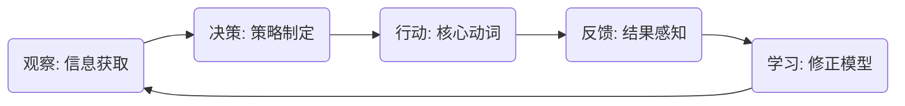

# [玩法名称] Core Gameplay Spec / 核心玩法规范

> **核心体验锚点 (Core Aesthetics)**
> 用一句话描述玩家在这个玩法中体验到的核心快感。
> *示例：在极度混乱中建立秩序的成就感 (Tetris)*
> *示例：在信息不完备的情况下进行高风险博弈 (Poker)*

---

## 1. 挑战模型 (Challenge Model)

### 1.1 阻力来源 (Resistance)
是什么阻止玩家达成目标？请明确核心挑战的类型。

*   [ ] **时间压力 (Time Pressure)**: 必须在有限时间内做出决策或操作。
*   [ ] **资源短缺 (Scarcity)**: 资源总量不足以满足所有需求，必须取舍。
*   [ ] **信息不完备 (Information Asymmetry)**: 必须在未知中推理。
*   [ ] **操作精度 (Dexterity)**: 需要高精度的物理操作。
*   [ ] **计算复杂度 (Complexity)**: 变量过多，难以预测结果。

### 1.2 核心动词 (Core Verb)
玩家克服阻力的主要手段是什么？
*   *示例：规划 (Planning), 反应 (Reacting), 交换 (Trading), 瞄准 (Aiming)*

---

## 2. 体验循环 (Experience Loop)

请描述玩家的一个完整心理循环 (Mental Loop)。

### 循环详解
*   **观察**: 玩家需要关注哪些关键信息？（例如：敌人的位置、手牌的余量）
*   **决策**: 玩家面临的主要权衡是什么？（例如：现在使用大招还是留着保命？）
*   **行动**: 玩家的具体输入是什么？
*   **反馈**: 系统如何告诉玩家“做得好”或“搞砸了”？

---

## 3. 验证准则 (Validation Heuristics)

针对核心体验的自我验证。

### 3.1 深度验证 (Depth Check)
*   **策略空间**: 熟练玩家是否能比新手高出 30% 以上的效率？通过什么机制实现的？
*   **重玩价值**: 同样的关卡/对局，第二次玩会有什么不同？（随机性？策略选择？）

### 3.2 节奏验证 (Pacing Check)
*   **压力窗口**: 玩家最高强度的操作持续多久？
*   **释放窗口**: 什么时候给玩家喘息的机会？

---

## 4. 执行细则 (Execution Details)

### 4.1 原子操作 (Atomic Actions)
列出玩家可执行的最小单位操作。

| 操作名称 | 触发方式 | 前置条件 | 结果 |
| :--- | :--- | :--- | :--- |
| *示例: 跳跃* | *按空格键* | *在地面上* | *施加垂直冲量* |

### 4.2 对象状态 (Object States)
关键交互对象的状态流转。

*   **对象 A**: [状态1] -> [事件] -> [状态2]

### 4.3 交互规则 (Interaction Rules)
操作如何改变状态的逻辑。

*   **规则 1**: ...
*   **规则 2**: ...
