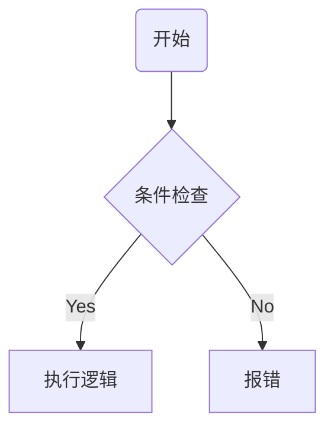

# [系统名称] System Spec / 系统设计规范

> **设计目的 (Design Goal)**
> *   **体验目标**: [引用语义标签，如 `[Aes: Mastery]`]
> *   **功能目标**: 解决什么具体问题？

---
## 1. 逻辑架构 (Logical Architecture)

### 1.1 核心对象 (Core Objects)
定义该系统管理的关键实体。

*   **对象 A**: [描述]
    *   **生命周期**: [创建 -> 销毁]
    *   **关键属性**: [列出核心字段]

### 1.2 数据结构 (Data Schema)
定义前后端交互或存储的数据格式。

```typescript
// 示例：玩家公会数据
interface GuildData {
    id: number;          // 公会ID
    level: number;       // 当前等级
    members: number[];   // 成员ID列表
}
```

### 1.3 流程图 (Flowchart)
**必须 (MUST)** 绘制核心交互流程。



### 1.4 交互细节 (Interaction Design)
*   **操作方式**: [点击/长按/拖拽/滑动]
*   **反馈表现**:
    *   **视觉**: [按下态/选中态/粒子特效]
    *   **听觉**: [点击音效/成功音效/失败音效]
    *   **触觉**: [震动反馈 (如适用)]

---
## 2. 原子规则 (Atomic Rules)

> **撰写指南**: 
> 1. 本章节必须使用 `规则撰写技能` 生成。
> 2. **禁止魔法数字**: 涉及数值必须使用 `{{VAR_NAME}}`。
> 3. **复用机制**: 涉及通用状态（如眩晕）时，请使用 `[机制:眩晕](../02_项目模板/通用机制库.md)` 格式。

### 规则 1: [规则名称]
*   **级别**: **必须 (MUST)**
*   **触发**: [用户操作 / 系统事件]
*   **检查**:
    1.  [条件 A]
    2.  [条件 B]
*   **执行**:
    1.  [数据变更 A]
    2.  [数据变更 B]
*   **反馈**:
    1.  [UI / 特效表现]
*   **异常**:
    1.  [失败处理]

### 规则 2: [规则名称]
...

---
## 3. 依赖与接口 (Dependencies)

### 3.1 外部依赖
*   依赖 **[背包系统]**: 扣除道具接口 `DeductItem(id, count)`。
*   依赖 **[邮件系统]**: 发放奖励接口 `SendMail(templateId)`。

### 3.2 对外接口
*   提供给 **[任务系统]**: `CheckGuildLevel()`。

---
## 4. 内容需求 (Content Requirements)

### 4.1 配置表 (Config Tables)

**表名**: `Table_Name` (例如 `GuildLevel`)

| 字段名 (Field) | 类型 (Type) | 分类 (Category) | 说明 (Desc) | 验证规则 (Validation) |
| :--- | :--- | :--- | :--- | :--- |
| `ID` | `int` | **🔑 Key** | 等级ID | `Unique, >0` |
| `ExpReq` | `int` | **🔢 Num** | 升级所需经验 | `>0, 递增` |
| `IconPath` | `string` | **🎨 Res** | 等级图标 | `FileExists(Assets/UI/...)` |
| `NameKey` | `string` | **📝 Text** | 等级名称键 | `Ref(Localization)` |

### 4.2 资源清单 (Asset List)
*   [ ] **UI**: [界面预制体名]
*   [ ] **Icon**: [图标路径]
*   [ ] **Model**: [3D模型/动作]
*   [ ] **SFX**: [音效名]

### 4.3 文案与包装 (Flavor Text)
*   **世界观定调**: [本系统在世界观中的解释]
    *   *示例：“公会”在本游戏中被称为“星际联盟”，是抵抗军的据点。*
*   **NPC 设定**: [功能 NPC 的人设与台词风格]

---
## 5. 运营验收 (Operations Check)

### 5.1 核心指标 (KPIs)
本系统上线后的预期数据表现。
*   **参与率**: [Expected DAU %]
*   **留存贡献**: [Expected Retention Lift]
*   **商业化**: [ARPU / 付费渗透率]

### 5.2 日志埋点 (Log Requirements)
必须定义核心行为日志，用于数据分析。

| 事件ID | 触发时机 | 关键参数 | 分析目的 |
| :--- | :--- | :--- | :--- |
| `SYS_USE` | 使用功能时 | `itemId`, `count` | 统计消耗 |
| `SYS_ERR` | 发生错误时 | `errCode` | 监控异常 |

---
## 6. 异常与边界 (Edge Cases)

| 场景 | 预期行为 | 错误码 |
| :--- | :--- | :--- |
| **断网重连** | 保持当前状态，或重新拉取数据 | - |
| **资源不足** | 按钮置灰，或点击弹出获取途径 | `ERR_NO_RES` |
| **数据超限** | 达到最大等级时隐藏升级按钮 | - |

---
## 7. 数值常量表 (Numeric Constants)

> **Auto-Generated**: 汇总本文档中出现的所有变量。

| 变量名 (Key) | 默认值 (Default) | 说明 (Desc) |
| :--- | :--- | :--- |
| `{{GUILD_CREATE_COST}}` | 500 | 创建公会消耗的钻石 |
| `{{GUILD_MAX_MEMBERS}}` | 30 | 1级公会最大人数 |
