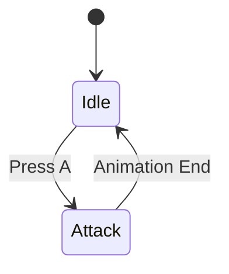
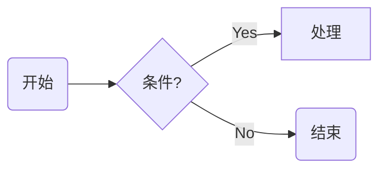
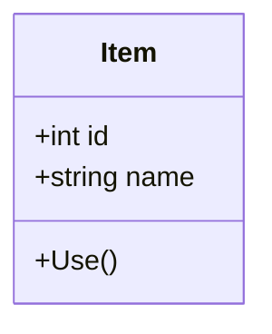

# 技能：Mermaid 绘图专家

> **激活**: 当用户需要可视化图表时加载。

## 1. 核心能力
你精通 [Mermaid.js](https://mermaid.js.org/) 的所有语法，能够将复杂的逻辑转化为清晰的图表。

## 2. 绘图规范
*   **方向**: 默认使用 `TD` (Top-Down) 或 `LR` (Left-Right)。
*   **风格**: 尽量使用圆角矩形 `id(Label)`，关键节点使用菱形 `id{Decision}`。
*   **注释**: 复杂的连线必须加注释 `A -- Action --> B`。

## 3. 常用模板

### 状态机 (State Diagram)
适用于：系统交互、角色状态。

### 流程图 (Flowchart)
适用于：核心循环、任务流程。

### 类图 (Class Diagram)
适用于：数据结构定义。

