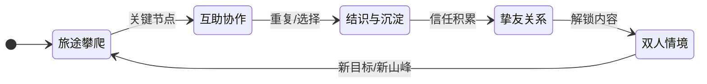

# 梦山 Core Loops (核心循环)

## 1. Loop Logic (循环逻辑)
玩家在旅途中攀登山峰，在关键节点依赖他人互助或帮助他人；单次协作带来即时过关与好感，多次协作可建立挚友关系；挚友关系解锁双人/多人情境内容，形成「一起登更多山、经历更多情境」的长线循环。

## 2. Loop Diagram (循环图)

## 3. Loop Layers & Time Boxing (分层与时间切片)

### 3.1 Micro Loop (秒级交互)
*   **Time Box**: 0.5s - 5s
*   **Core Action**: [输入] 攀爬/托举/拉拽/借力 → [反馈] 角色位移与状态变化 → [结果] 成功登上一段/失败重试
*   **Feel**: 粘滞、可靠、配合感（协作成功时有明确反馈）

### 3.2 Mid Loop (单程/单段登山)
*   **Time Box**: 3min - 15min
*   **Structure**:
    1.  **Prep (准备)**: 选择路线/匹配或组队
    2.  **Action (执行)**: 攀爬 + 关键节点互助
    3.  **Reward (结算)**: 到达检查点/登顶、关系进度、解锁情境入口
*   **Goal**: 完成一段旅途、与某人建立/深化关系

### 3.3 Macro Loop (长线养成)
*   **Time Box**: 1 周 - 3 个月
*   **Structure**: [旅途与互助] → [结识与挚友] → [双人/多人情境] → [新山峰与新情境]
*   **Goal**: 拥有稳定搭档/小队，共同体验专属情境与登顶记忆

---

## 4. Motivation Drivers (驱动力分析)

| 循环层级 | 驱动力 (Driver) | 心理学机制 (Psychology) |
| :--- | :--- | :--- |
| **Micro** | 操作成功、配合默契 | 即时反馈与 Mastery |
| **Mid** | 一起过关、被需要/需要他人 | 归属感与协作认同 |
| **Macro** | 固定的人、专属内容 | 关系所有权与 Social Proof |

---

## 5. Altruistic Design Rules (利他设计规则) — MUST 覆盖

> 对应创意验证书「从偶然的善意到可预期的羁绊」及 Vision 关键体验。
*   **[规则]**: 「帮助他人」与「被他人帮助」**必须**在循环中有明确的正向反馈；利他行为不得被设计为纯成本。
*   **[规则]**: 陌生人互助**必须**为可选；主线路段不得依赖陌生人助力才能推进。
*   **[规则]**: 独行玩家**必须**可完成核心体验；协作作为增强路径，非强制路径。
