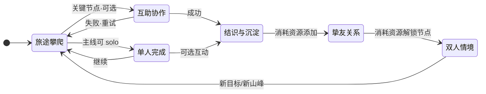

# 梦山 Core Loops (核心循环)

## 1. Loop Logic (循环逻辑)
玩家在旅途中攀登山峰，在关键节点依赖他人互助或帮助他人；单次协作带来即时过关与情感反馈；成为好友（同行者）与解锁双人情境**全由玩家主动消耗资源**完成，非协作数值积累。好友关系与已解锁节点决定可进入的双人/多人情境，形成「一起登更多山、经历更多情境」的长线循环。

**与光遇对齐的周期转化**: 主线由**当期内容**（如若干张地图/岛屿）构成；当玩家**完成当期全部内容**后，通过**周目仪式**将本周期内积累的**「体力增幅能力」** 转化为**「永久增幅能力」**。  
*   **临时增幅**: 在本周期内通过探索/收集获得，可因玩法内定义的事件（如受挫、死亡等）而失去，需再次收集。  
*   **永久增幅**: 由「周目完成 → 献祭/仪式」将临时增幅折算为**高级货币**，再经兑换获得；**不会**因玩法内事件失去，为长期成长锚点。

## 2. Loop Diagram (循环图)

*   **单人路径**: 主线路段可全程单人通过，无需进入互助协作；协作失败可重试，无惩罚性损失。

## 3. Loop Layers & Time Boxing (分层与时间切片)

### 3.1 Micro Loop (秒级交互)
*   **Time Box**: 0.5s - 5s
*   **Core Action**: [输入] 攀爬/托举/拉拽/借力 → [反馈] 角色位移与状态变化 → [结果] 成功登上一段/失败重试
*   **失败处理**: 协作失败可重试，无惩罚性损失；玩家可放弃并选择其他路径（若有）。
*   **Feel**: 粘滞、可靠、配合感（协作成功时有明确反馈）

### 3.2 Mid Loop (单程/单段登山)
*   **Time Box**: 3min - 15min
*   **Structure**:
    1.  **Prep (准备)**: 选择路线/匹配或组队
    2.  **Action (执行)**: 攀爬 + 关键节点互助
    3.  **Reward (结算)**: 到达检查点/登顶、情感反馈、解锁情境入口（情境解锁由攀登进度或玩家消耗资源解锁关系节点驱动）
*   **Goal**: 完成一段旅途、与某人建立/深化关系

### 3.3 Macro Loop (长线养成)
*   **Time Box**: 约 7–90 小时（按每天预期游玩 2 小时换算：1 周–3 个月）
*   **Structure**: [旅途与互助] → [结识与挚友] → [双人/多人情境] → [新山峰与新情境]
*   **Goal**: 拥有稳定搭档/小队，共同体验专属情境与登顶记忆

*   **阶段与节奏** *(按累计游玩时间)*:
    | 阶段 | 时长 | 备注 |
    | 初期/新手期 | 0–3 小时 | |
    | 前中期 | 3–15 小时 | 首轮献祭路径约 15 小时 |
    | 中期 | 15–100 小时 | 双人/多人情境重点投放 |
    | 后期 | 100–300 小时 | |
    | 成熟期 | 300 小时以上 | |

### 3.4 Content Period Loop (内容周期 / 周目循环)
*   **Time Box**: 一期内容（若干地图/岛屿）完整通关为一周期
*   **Structure**:
    1.  **探索与收集**: 在本期地图中获取**临时增幅能力**（如临时翼），提升体力/行动上限。
    2.  **受挫风险**: 玩法内定义的事件（如失败、献祭节点等）可能导致**临时增幅**损失，需再收集。
    3.  **周期完成**: 当期主线/地图**全部完成**后，触发**周目仪式**（献祭等）。
    4.  **转化**: 仪式中**失去所有临时增幅**，按规则折算为**高级货币**。
    5.  **兑换永久**: 使用高级货币在兑换处换取**永久增幅能力**（如永久翼）；永久增幅**不会**因玩法内事件失去。
*   **Goal**: 将「本期努力」固化为「长期能力」，形成可预期的成长与复玩动力。

---

## 4. Motivation Drivers (驱动力分析)

| 循环层级 | 驱动力 (Driver) | 心理学机制 (Psychology) |
| :--- | :--- | :--- |
| **Micro** | 操作成功、配合默契 | 即时反馈与 Mastery |
| **Mid** | 一起过关、被需要/需要他人 | 归属感与协作认同 |
| **Macro** | 固定的人、专属内容 | 关系所有权与 Social Proof |
| **Content Period** | 本期收集→周目转化→永久成长 | 可预期的长期收益、损失后再收集的复玩动力 |

---

## 5. Altruistic Design Rules (利他设计规则) — MUST 覆盖

> 对应创意验证书「从偶然的善意到可预期的羁绊」及 Vision 关键体验。
*   **[规则]**: 「帮助他人」与「被他人帮助」**必须**在循环中有明确的正向反馈；利他行为不得被设计为纯成本。
*   **[规则]**: 陌生人互助**必须**为可选；主线路段不得依赖陌生人助力才能推进。
*   **[规则]**: 独行玩家**必须**可完成核心体验；协作作为增强路径，非强制路径。
