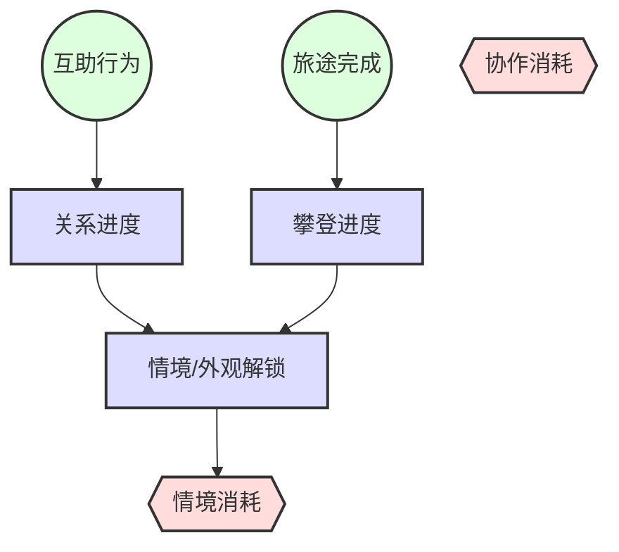

# 梦山 Resource Flow (资源流)

## 1. Flow Logic (流向逻辑)
攀登进度与关卡解锁由「完成旅途」驱动；关系进度由「互助行为与共同完成」产生；情感/信任类资源用于解锁双人情境与外观等；经济资源（若存在）主要用于外观、便捷与非核心体验，不购买攀爬/协作能力。

## 2. Flow Chart (流向图)

## 3. Machinations Model (系统动力学模型)

### Sources (源 / 龙头)
*   **旅途完成**: 完成单段登山/到达检查点，产出攀登进度与关卡解锁。
*   **互助行为**: 托举、拉拽、借力等成功协作，产出关系进度与情感反馈。

### Pools (池 / 蓄水池)
*   **关系进度**: 与某玩家的信任/挚友度，用于解锁双人情境与权益。
*   **攀登进度**: 已解锁路线/山峰与检查点，决定可参与的内容。
*   **情境/外观解锁**: 双人情境入口、外观等（可由关系进度或攀登进度驱动）。

### Converters (转换器)
*   **关系 → 情境**: 关系进度达到阈值 → 解锁与该校色相关的双人/多人情境。
*   **攀登 → 情境**: 攀登进度达到条件 → 解锁新情境或新路线。

### Sinks (汇 / 漏斗)
*   **情境消耗**: 进入双人/多人情境时消耗「入场资格」或次数（若设计需要）。
*   **协作消耗**: 若设计体力/次数限制，则单次协作消耗对应资源（需避免影响核心体验）。

### Trader (交换 / 市场)
*   仅限外观、便捷类；不交易攀爬能力或协作数值优势。
