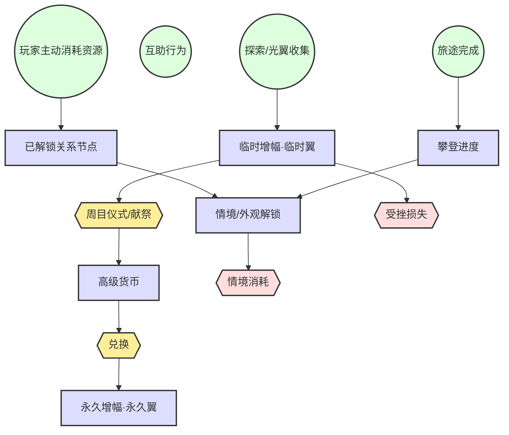

# 梦山 Resource Flow (资源流)

## 1. Flow Logic (流向逻辑)
攀登进度与关卡解锁由「完成旅途」驱动；**关系与情境解锁全由玩家主动消耗资源完成**——无信任度/好感度等数值积累，添加好友、对白可见、双人情境入口等权益均需在关系树上消耗资源解锁；互助行为仅提供情感反馈，不直接产出可解锁的数值。经济资源（若存在）主要用于外观、便捷、**关系树解锁**与非核心体验，不购买攀爬/协作能力。

**体力增幅能力（冒险能力）**: 本游戏核心积累之一为**飞翼数/体力增幅**，分为两类。  
*   **临时增幅（临时翼）**: 在本周期探索中收集，可因玩法内定义的事件（受挫、献祭等）而失去，需再收集。  
*   **永久增幅（永久翼）**: 通过**周目仪式**将本期临时增幅折算为**高级货币**，再经兑换获得；**不会**因玩法内事件失去。  
主线完成当期全部内容后，通过**献祭/周目仪式**将周期内的【体力增幅能力】由临时转为可兑换永久增幅的**高级货币**，从而完成「临时 → 永久」的闭环。

## 2. Flow Chart (流向图)

## 3. Machinations Model (系统动力学模型)

### Sources (源 / 龙头)
*   **旅途完成**: 完成单段登山/到达检查点，产出攀登进度与关卡解锁。
*   **互助行为**: 托举、拉拽、借力等成功协作，产出情感反馈（归属感、成就感等）；**不产出关系数值**，不直接解锁权限。
*   **玩家主动消耗资源**: 添加好友、解锁关系树节点（对白可见、系绳、双人情境入口等）均需消耗资源；双方确认后解锁对应权益。
*   **探索/光翼收集**: 在本期地图中收集临时翼等，产出**临时增幅能力**。

### Pools (池 / 蓄水池)
*   **已解锁关系节点**: 与某玩家关系中，已通过消耗资源解锁的节点列表（添加好友、对白可见、系绳、双人情境入口等）；决定双方交互权益，**无信任度/好感度数值积累**。
*   **攀登进度**: 已解锁路线/山峰与检查点，决定可参与的内容。
*   **情境/外观解锁**: 双人情境入口、外观等（由已解锁关系节点或攀登进度驱动）。
*   **临时增幅（临时翼）**: 本期探索获得的体力/行动上限增幅；可因玩法内事件（受挫、献祭等）损失。
*   **高级货币**: 周目仪式中将临时增幅折算得到的货币，用于兑换永久增幅与先祖列表等。
*   **永久增幅（永久翼）**: 用高级货币兑换获得；**不会**因玩法内事件失去，为长期能力锚点。

### Converters (转换器)
*   **关系节点 → 情境**: 玩家消耗资源解锁某关系节点 → 解锁与该对象相关的双人/多人情境入口。
*   **攀登 → 情境**: 攀登进度达到条件 → 解锁新情境或新路线。
*   **周目仪式/献祭**: 当期内容全部完成后触发；**失去所有临时翼**，按规则折算为**高级货币**。
*   **兑换**: 使用高级货币兑换**永久翼**及先祖兑换列表中的内容。

### Sinks (汇 / 漏斗)
*   **情境消耗**: 双人/多人情境采用**一次性开启制**；进入后在指定时间内必须完成，若超时未完成则副本重置；只有彻底完成才能带出该情境对应的奖励。大多数情境为一次性或周期性开放。
*   **协作消耗**: **[决策] 协助本身不消耗体力/次数**；互助是设计师鼓励的行为，不做节奏限制。
*   **受挫损失**: 玩法内定义的事件（如失败、特定节点）导致**临时增幅**减少或清空；永久增幅不受影响。

### Trader (交换 / 市场)
*   仅限外观、便捷类；不交易攀爬能力或协作数值优势。
