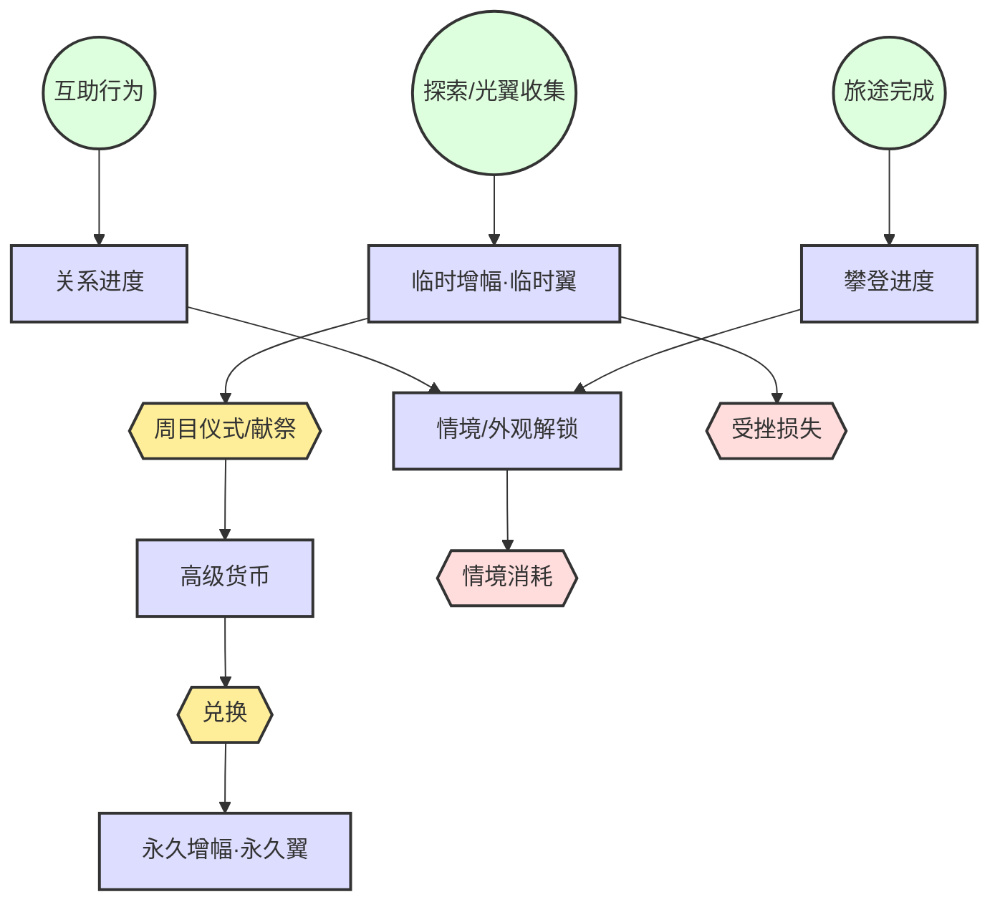

# 梦山 Resource Flow (资源流)

## 1. Flow Logic (流向逻辑)
攀登进度与关卡解锁由「完成旅途」驱动；关系进度由「互助行为与共同完成」产生；情感/信任类资源用于解锁双人情境与外观等；经济资源（若存在）主要用于外观、便捷与非核心体验，不购买攀爬/协作能力。

**体力增幅能力（冒险能力）**: 本游戏核心积累之一为**飞翼数/体力增幅**，分为两类。  
*   **临时增幅（临时翼）**: 在本周期探索中收集，可因玩法内定义的事件（受挫、献祭等）而失去，需再收集。  
*   **永久增幅（永久翼）**: 通过**周目仪式**将本期临时增幅折算为**高级货币**，再经兑换获得；**不会**因玩法内事件失去。  
主线完成当期全部内容后，通过**献祭/周目仪式**将周期内的【体力增幅能力】由临时转为可兑换永久增幅的**高级货币**，从而完成「临时 → 永久」的闭环。

## 2. Flow Chart (流向图)

## 3. Machinations Model (系统动力学模型)

### Sources (源 / 龙头)
*   **旅途完成**: 完成单段登山/到达检查点，产出攀登进度与关卡解锁。
*   **互助行为**: 托举、拉拽、借力等成功协作，产出关系进度与情感反馈。
*   **探索/光翼收集**: 在本期地图中收集临时翼等，产出**临时增幅能力**。

### Pools (池 / 蓄水池)
*   **关系进度**: 与某玩家的信任/挚友度，用于解锁双人情境与权益。
*   **攀登进度**: 已解锁路线/山峰与检查点，决定可参与的内容。
*   **情境/外观解锁**: 双人情境入口、外观等（可由关系进度或攀登进度驱动）。
*   **临时增幅（临时翼）**: 本期探索获得的体力/行动上限增幅；可因玩法内事件（受挫、献祭等）损失。
*   **高级货币**: 周目仪式中将临时增幅折算得到的货币，用于兑换永久增幅与先祖列表等。
*   **永久增幅（永久翼）**: 用高级货币兑换获得；**不会**因玩法内事件失去，为长期能力锚点。

### Converters (转换器)
*   **关系 → 情境**: 关系进度达到阈值 → 解锁与该角色相关的双人/多人情境。
*   **攀登 → 情境**: 攀登进度达到条件 → 解锁新情境或新路线。
*   **周目仪式/献祭**: 当期内容全部完成后触发；**失去所有临时翼**，按规则折算为**高级货币**。
*   **兑换**: 使用高级货币兑换**永久翼**及先祖兑换列表中的内容。

### Sinks (汇 / 漏斗)
*   **情境消耗**: 双人/多人情境采用**一次性开启制**；进入后在指定时间内必须完成，若超时未完成则副本重置；只有彻底完成才能带出该情境对应的奖励。大多数情境为一次性或周期性开放。
*   **协作消耗**: **[决策] 协助本身不消耗体力/次数**；互助是设计师鼓励的行为，不做节奏限制。
*   **受挫损失**: 玩法内定义的事件（如失败、特定节点）导致**临时增幅**减少或清空；永久增幅不受影响。

### Trader (交换 / 市场)
*   仅限外观、便捷类；不交易攀爬能力或协作数值优势。
