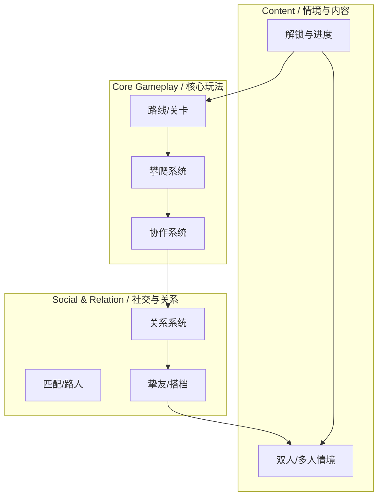

# 梦山 System Architecture / 系统架构白皮书

> **文档状态**: Draft
> **核心依赖**: 基于 `02_Pillars_设计支柱.md` 与 `03_Loops_核心循环.md`。

---

## 1. 架构总览 (Executive Summary)

### 1.1 设计目标 (Design Goal)
*   **体验目标**: 支撑「旅途攀爬 → 互助协作 → 结识挚友 → 双人/多人情境」的闭环。
*   **复杂度控制**: 核心玩法（攀爬+协作）优先；社交与情境模块围绕「固定的人」与「一起做事」展开，避免系统堆砌。

### 1.2 系统拓扑图 (System Landscape)

---

## 2. 核心循环映射 (Core Loop Mapping)

| 循环步骤 (Step) | 关键行为 (Action) | 支撑系统 (Primary Systems) |
| :--- | :--- | :--- |
| **1. 目标** | 选路线、组队/匹配 | 路线/关卡、匹配系统 |
| **2. 挑战** | 攀爬、托举/拉拽/借力 | 攀爬系统、协作系统 |
| **3. 奖励** | 到达检查点、情感反馈 | 关卡进度、关系系统 |
| **4. 成长** | 挚友、解锁情境 | 关系系统、双人/多人情境 |

---

## 3. 系统生态详述 (System Ecology)

### 3.1 [MOD_CORE] 核心玩法模块
> **Design Pillar**: 互助即玩法

*   **[SYS_CLIMB] 攀爬系统** (P0)
    *   **Loop Role**: Challenge（核心操作）
    *   **Input**: 路线配置、支点与障碍
    *   **Output**: 位移、状态、成败反馈
    *   **Feature Scope**: 基础攀爬、支点/借力判定；❌ 纯自动寻路登顶

*   **[SYS_COOP] 协作系统** (P0)
    *   **Loop Role**: Challenge + Reward（互助行为产生结果与关系）
    *   **Input**: 多人状态、托举/拉拽/借力输入
    *   **Output**: 协作成败、情感反馈（关系权益由玩家消耗资源解锁，非协作产出）
    *   **Feature Scope**: 托举、拉拽、借力等明确操作；❌ 仅表情/站桩无玩法结果

*   **[SYS_ROUTE] 路线/关卡系统** (P0)
    *   **Loop Role**: Goal + Source（定义旅途与进度）
    *   **Input**: 关卡配置
    *   **Output**: 攀登进度、情境解锁条件
    *   **Feature Scope**: 单段登山、检查点；**双人必过节点仅出现于隐藏/分支/双人情境，不在主线**；❌ 单人可完全替代协作

### 3.2 [MOD_SOCIAL] 社交与关系模块
> **Design Pillar**: 双人/多人情境是长期锚点

*   **[SYS_RELATION] 关系系统** (P0)
    *   **Loop Role**: Growth
    *   **Input**: 互助行为、共同完成
    *   **Output**: 挚友/搭档、情境解锁权益
    *   **Feature Scope**: 陌生人→挚友进度、固定搭档；❌ 纯数值战力关系

*   **[SYS_SITUATION] 双人/多人情境** (P1)
    *   **Loop Role**: Goal & Growth
    *   **Input**: 挚友关系、攀登进度
    *   **Output**: 专属情境内容与记忆点
    *   **Feature Scope**: 仅双人/小队可进入的关卡与情境；❌ 单人可替代

### 3.3 [MOD_ECONOMY] 经济与表现
> **Design Pillar**: 情感优先于数值

*   **Demo 阶段**: 无需过度考量经济系统。
*   **正式版**: 经济系统为重要模块，待细化；**边界**：仅限外观、便捷、非核心；📤 不产出攀爬/协作数值优势；📥 不设 Pay-to-Win 消耗。

---

## 4. 支柱验证矩阵 (Pillar Validation)

| 系统 | 互助即玩法 | 情感优先于数值 | 双人情境锚点 | 备注 |
| :--- | :---: | :---: | :---: | :--- |
| **攀爬系统** | ✅ | - | - | 核心操作 |
| **协作系统** | ✅ | ✅ | - | 关系来源 |
| **路线/关卡** | ✅ | - | - | 协作节点 |
| **关系系统** | - | ✅ | ✅ | 挚友与解锁 |
| **双人/多人情境** | - | ✅ | ✅ | 长期锚点 |

---

## 5. 开发规划 (Development Roadmap) — Demo 相关

| 优先级 | 系统名称 | 依赖项 | 预计版本 | 备注 |
| :--- | :--- | :--- | :--- | :--- |
| P0 | 攀爬原型 | 角色与场景 | Demo | 可玩片段给投资人/团队 |
| P0 | 协作原型 | 攀爬 + 双人 | Demo | 托举/拉拽至少一种 |
| P0 | 单段路线 | 攀爬+协作 | Demo | 一段「必须协作才能过」的体验 |
| P1 | 关系树与解锁展示 | 关系系统 | Alpha 后 | Demo 可仅展示「结识」概念 |
| P1 | 双人情境 | 关系系统 | Beta | 中后期 |
