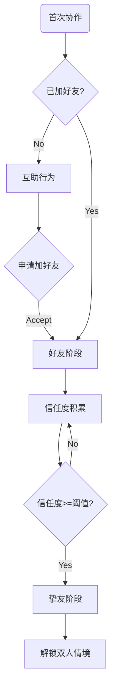

# 梦山 系统设计规范 — 关系系统 (Relation System Spec)

> **设计目的 (Design Goal)**
> *   **体验目标**: [Aes: Belonging] 支撑「陌生人→挚友」的关系沉淀，形成「固定的人一起玩」的长期锚点。
> *   **功能目标**: 管理玩家间的信任/挚友度，解锁双人/多人情境与权益。
> **设计支柱引用**: [双人/多人情境是长期锚点](../00_项目核心/02_Pillars_设计支柱.md)
> **更新日期**: 2026-02-07

---
## 1. 逻辑架构 (Logical Architecture)

### 1.1 设计原则 (Design Principles)

*   **关系一致性 (Relation Consistency)**  
    玩家彼此间的关系**一定一致**，即不存在「我认为你是我的【挚友】，而你却显示我是你的【陌生人】」。双方对同一对关系的状态判定必须一致。

### 1.2 关系状态定义 (Relation State Definition)

以下状态为系统内部状态，**命名不需要呈现给玩家**，仅用于逻辑与配置。

| 状态码 | 内部名称 | 说明 | 表现与约束 |
| :--- | :--- | :--- | :--- |
| **0** | 陌生人 | 通过分配机制在场景中遭遇的其他无交集玩家，通常仅显示统一的默认人物形象（类似光遇）。 | 无 Avatar，无碰撞。 |
| **1** | 邂逅者 | 通过【互助】行为或特定的【认识】行为后，角色形象清晰呈现在彼此眼中。**仅在当前时间/场景框架内生效。** | 呈现 Avatar，有碰撞。成为 1 后，玩家可主动【告别】，使之回退到 0。 |
| **2** | 同行者 | 通过特定的添加-确认行为，成为彼此好友列表中的玩家。 | 成为 2 之后，**无法回退到 0 和 1**，但可以变为 3。2 之后有一系列功能开关，是否可进行交互需单独判断。 |
| **3** | 异路者 | 通过屏蔽、举报等行为投诉过的玩家，会尽量在匹配机制中规避。 | 可在黑名单内进行移除操作，回归到进入 3 前的原状态。 |

### 1.3 核心对象 (Core Objects)
*   **关系 (Relation)**:
    *   **生命周期**: 陌生人(0) → 邂逅者(1) → 同行者(2) → [可选] 异路者(3)；邂逅者可告别回退至 0；异路者可移除回归原状态。
    *   **关键属性**: 关系双方 ID、关系状态码(0/1/2/3)、信任度/挚友度、解锁情境列表

*   **关系阶段 (Relation Stage)**（与状态码对应）:
    *   **0 陌生人**: 场景分配遭遇，无 Avatar、无碰撞
    *   **1 邂逅者**: 单次场景内互助/认识，有 Avatar、有碰撞，可告别回退
    *   **2 同行者**: 已加好友，可组队、查看状态，信任度达阈值可升为挚友/搭档
    *   **3 异路者**: 屏蔽/举报后，匹配规避；黑名单可移除恢复

### 1.4 数据结构 (Data Schema)

```typescript
// 玩家关系数据（双方存储一致，保证关系一致性）
interface RelationData {
    id: string;              // 关系ID (playerA_id + playerB_id 有序)
    playerA: number;         // 玩家A ID
    playerB: number;         // 玩家B ID
    state: RelationState;    // 0陌生人 | 1邂逅者 | 2同行者 | 3异路者
    trustValue: number;      // 信任度/挚友度（同行者阶段使用）
    unlockedSituations: number[];  // 已解锁的双人情境ID列表
    lastCooperateTime: number;     // 最近一次协作时间戳
    sceneFrameId?: string;   // 邂逅者(1) 仅在当前时间/场景框架内生效时的场景标识
}

/** 关系状态：内部使用，命名不呈现给玩家 */
enum RelationState {
    Stranger = 0,   // 陌生人
    Encounter = 1,  // 邂逅者
    Companion = 2,  // 同行者（好友/挚友）
    Avoided = 3     // 异路者
}
```

### 1.5 流程图 (Flowchart)



### 1.6 交互细节 (Interaction Design)
*   **操作方式**: 协作成功后可选「加好友」；挚友状态在 UI 中展示（搭档标识、可进入的双人情境入口）。
*   **反馈表现**:
    *   **视觉**: 关系阶段图标、信任度进度条、解锁情境的入场动画
    *   **听觉**: 加好友/成为挚友时的提示音
    *   **触觉**: [可选] 成为挚友时的震动反馈

---
## 2. 原子规则 (Atomic Rules)

### 规则 0: 关系一致性 (Relation Consistency)
*   **级别**: **必须 (MUST)**
*   **触发**: 任意一方关系状态变更时
*   **检查**: 双方服务器/客户端数据可用
*   **执行**: 将新状态**同步写入**关系双方的数据；双方对同一对关系的 state 必须一致。
*   **异常**: 同步失败时回滚或重试，严禁出现双方状态不一致

### 规则 1: 邂逅与告别 (Encounter & Farewell)
*   **级别**: **必须 (MUST)**
*   **触发**: 互助/认识行为成功 → state 置为 1（邂逅者）；玩家主动【告别】→ state 回退为 0（陌生人）
*   **检查**: 邂逅者(1) 仅在当前时间/场景框架内生效；告别仅当 state === 1 时允许
*   **执行**: 0↔1 仅在当前场景有效；写入时带 sceneFrameId；告别后清除 Avatar、碰撞
*   **异常**: 跨场景/跨会话后邂逅者自动视为失效（按 0 处理），除非已升为 2

### 规则 2: 互助产生信任度
*   **级别**: **必须 (MUST)**
*   **触发**: 托举/拉拽等协作成功
*   **检查**: 双方均为玩家（非 NPC）；协作节点有效
*   **执行**: 双方关系信任度 +{{TRUST_PER_COOP}}；更新 lastCooperateTime
*   **反馈**: 信任度增加动画/数字飘字（若已加好友）
*   **异常**: 未加好友时，信任度可预积累但暂不展示；加好友后合并

### 规则 3: 信任度达阈值解锁挚友
*   **级别**: **必须 (MUST)**
*   **触发**: 信任度达到 {{TRUST_THRESHOLD_BUDDY}}
*   **检查**: 双方已是好友
*   **执行**: stage 升级为 Buddy；解锁对应双人情境入口
*   **反馈**: 挚友解锁演出、情境入口高亮
*   **异常**: 若一方解除好友，挚友状态与情境权益失效

### 规则 4: 挚友解锁双人情境
*   **级别**: **必须 (MUST)**
*   **触发**: 进入双人/多人情境
*   **检查**: 双方为挚友；情境已解锁；双方在线
*   **执行**: 进入情境实例；消耗入场资格（若设计需要）
*   **反馈**: 情境加载、双人演出
*   **异常**: 对方离线时提示「等待搭档上线」

### 规则 5: 异路者与移除 (Avoided & Unblock)
*   **级别**: **必须 (MUST)**
*   **触发**: 屏蔽/举报等行为 → state 置为 3（异路者）；在黑名单内执行移除 → 回归进入 3 前的原状态
*   **检查**: 匹配机制需查询 state，对 3 尽量规避；移除仅允许在黑名单/屏蔽列表界面操作
*   **执行**: 进入 3 时记录 previousState；移除时恢复 previousState，并同步双方
*   **异常**: 若原状态为 1（邂逅者），恢复后因场景可能已失效，按 0 处理

---
## 3. 依赖与接口 (Dependencies)

### 3.1 外部依赖
*   依赖 **[协作系统]**: 协作成功事件 `OnCooperateSuccess(playerA, playerB, coopType)`
*   依赖 **[双人情境]**: 情境解锁条件检查 `CanEnterSituation(relationId, situationId)`

### 3.2 对外接口
*   提供给 **[匹配系统]**: `GetBuddyList(playerId)` — 获取挚友列表用于组队
*   提供给 **[情境系统]**: `IsBuddy(playerA, playerB)` — 检查是否挚友
*   提供给 **[UI]**: `GetRelationStage(playerA, playerB)` — 展示关系状态

---
## 4. 内容需求 (Content Requirements)

### 4.1 配置表 (Config Tables)

**表名**: `RelationStage`

| 字段名 | 类型 | 分类 | 说明 | 验证规则 |
| :--- | :--- | :--- | :--- | :--- |
| ID | int | 🔑 Key | 阶段ID | Unique, >0 |
| StageName | string | 📝 Text | 阶段名称键 | Ref(Localization) |
| TrustReq | int | 🔢 Num | 所需信任度 | >=0 |
| UnlockSituations | int[] | 🔢 Num | 解锁情境ID列表 | Ref(Situation) |

**表名**: `TrustConfig`

| 字段名 | 类型 | 分类 | 说明 | 验证规则 |
| :--- | :--- | :--- | :--- | :--- |
| CoopType | string | 🔑 Key | 协作类型 | 托举/拉拽/借力 |
| TrustGain | int | 🔢 Num | 单次信任度增加 | >0 |

### 4.2 数值常量表 (Numeric Constants)

| 变量名 | 默认值 | 说明 |
| :--- | :--- | :--- |
| {{TRUST_PER_COOP}} | 10 | 单次协作成功增加的信任度 |
| {{TRUST_THRESHOLD_BUDDY}} | 100 | 成为挚友所需信任度 |
| {{MAX_TRUST}} | 999 | 信任度上限 |

---
## 5. 异常与边界 (Edge Cases)

| 场景 | 预期行为 | 错误码 |
| :--- | :--- | :--- |
| 关系一致性 | 任一方 state 变更必须同步对方，严禁双向显示不一致 | - |
| 邂逅者跨场景/跨会话 | 状态 1 仅当前场景有效，离开后按 0 处理 | - |
| 主动告别（1→0） | 仅 state=1 时可操作；执行后无 Avatar、无碰撞 | - |
| 同行者(2) 回退 | 不允许回退到 0 或 1，仅可变为 3（异路者） | - |
| 异路者移除 | 仅能在黑名单内操作，恢复为进入 3 前的 previousState | - |
| 断网重连 | 重新拉取关系数据，保持本地缓存 | - |
| 对方解除好友 | 挚友权益收回；若解除为陌生人，按产品定义是否允许回退 | - |
| 重复加好友 | 忽略，保持同行者(2) 状态 | - |
| 信任度溢出 | cap 在 {{MAX_TRUST}} | - |

---
## 6. 与 PEAK 的差异（梦山保留）

*   **PEAK**：无陌生人/邂逅者/同行者等关系分级；同局队友均可互相访问背上背包、使用道具、救援，无权限门槛。
*   **梦山保留**：关系状态 0/1/2/3 及关系一致性；「谁可对谁 Take_Item、使用综合功效道具、系绳」等均由关系门控决定（见《协作与救援》4.3）。冲突时以梦山关系系统为准。
