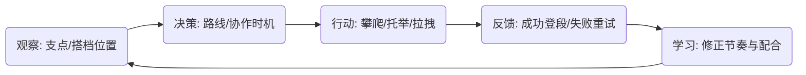

# 梦山 核心玩法规范 — 攀爬与协作 (Core Gameplay Spec)

> **核心体验锚点 (Core Aesthetics)**: 在旅途中，因一次真实的互助而与陌生人建立信任，共同克服障碍登顶的归属感。
> **设计支柱引用**: [互助即玩法](../00_项目核心/02_Pillars_设计支柱.md)
> **更新日期**: 2026-02-07

---

## 1. 挑战模型 (Challenge Model)

### 1.1 阻力来源 (Resistance)
*   [x] **操作精度 (Dexterity)**: 需要精准的支点选择、借力时机与协作配合。
*   [x] **协作协调 (Coordination)**: 托举/拉拽需要与搭档在时空上对齐。
*   [ ] **时间压力 (Time Pressure)**: 可选；部分节点可设计限时借力。
*   [ ] **资源短缺 (Scarcity)**: 不用于核心攀爬；体力/次数限制需谨慎，避免影响核心体验。

### 1.2 核心动词 (Core Verb)
*   **攀爬 (Climbing)**: 抓取支点、位移、借力、失败重试。
*   **互助 (Cooperating)**: 托举、拉拽、借力——必须影响关卡进度或成败，而非仅社交动作。

---

## 2. 体验循环 (Experience Loop)

### 循环详解
*   **观察**: 玩家需关注支点分布、搭档状态、协作触发区域。
*   **决策**: 面临「现在攀还是等搭档」「谁来托举/拉拽」等权衡。
*   **行动**: 攀爬输入（抓取/释放）、托举/拉拽输入（朝向、范围）。
*   **反馈**: 位移、成功/失败音效与特效；协作成功时明确「我们一起做到了」的成就感。

---

## 3. 验证准则 (Validation Heuristics)

### 3.1 深度验证 (Depth Check)
*   **策略空间**: 熟练玩家能通过路线预判与协作节奏，减少失败次数；新手与熟练玩家的差距可通过「重试成本可控」缓和。
*   **重玩价值**: 同一路线，双人协作 vs 单人、不同搭档，体验不同；隐藏/分支路线需协作才有解法。

### 3.2 节奏验证 (Pacing Check)
*   **压力窗口**: 单段攀爬 3–15 分钟；关键协作节点处压力集中。
*   **释放窗口**: 到达检查点、登顶、协作成功后给予喘息与成就感。

---

## 4. 执行细则 (Execution Details)

### 4.1 原子操作 (Atomic Actions)

| 操作名称 | 触发方式 | 前置条件 | 结果 |
| :--- | :--- | :--- | :--- |
| 抓取支点 | 按键/触控 | 在支点范围内 | 角色吸附支点，可进行位移 |
| 释放支点 | 松开 | 已抓取支点 | 脱离支点，可能下落 |
| 借力跳跃 | 按键 | 在借力支点/搭档附近 | 获得额外冲量，到达更高支点 |
| 托举 | 按键+朝向 | 搭档在托举范围内、搭档处于可托举状态 | 搭档获得上升力，协作成功 |
| 拉拽 | 按键+朝向 | 搭档在拉拽范围内、搭档处于可拉拽状态 | 搭档被拉至拉拽者位置，协作成功 |

### 4.2 对象状态 (Object States)
*   **角色**: 自由下落 → [抓取支点] → 攀爬中 → [释放/借力] → 自由下落 / 到达新支点
*   **协作节点**: 未触发 → [双方进入区域+输入] → 协作成功 / 协作失败（超时/错位）

### 4.3 互助行为定义 (Cooperation Actions Definition)

游戏中核心互助行为及**关系门控**如下。关系状态参见 [关系系统](系统设计规范_关系系统.md)（0 陌生人 / 1 邂逅者 / 2 同行者）。

| 序号 | 互助行为 | 说明 | 关系要求 |
| :--- | :--- | :--- | :--- |
| 1 | **拉上去** | 站在高处，对区域内山壁上的玩家执行「拉上去」操作 | 无关系要求 |
| 2 | **响应玩家状态交互** | 根据玩家身上的状态进行交互（如：有刺则帮忙拔出，有火焰则帮忙扑灭等） | 无关系要求 |
| 3 | **使用明显无副作用的道具** | 对他人使用被定义为「明显无副作用」的道具 | 无关系要求 |
| 4 | **系在同一根登山绳索上** | 经二次确认后，与对方系在同一条登山绳索上（类似光遇牵手） | **必须 1（邂逅者）或 2（同行者）** |
| 5 | **使用【综合功效】道具** | 使用可能带来负面效果的综合功效类道具 | **必须 2（同行者）** |
| 6 | **其他互动行为** | 背人、交际舞等与其它玩家互动的行为 | **必须 2（同行者）+ 特定功能开关** |

### 4.4 未定义但可能产生的行为 (Emergent / Out of Scope)

以下行为**当前不被正式定义**为互助行为，但可能因基础规则或物理/交互规则自然产生，需在实现时做边界与风险控制：

| 行为 | 说明 | 备注 |
| :--- | :--- | :--- |
| 蹲下（托举） | 蹲下形成托举支点 | 与「拉上去」区分；是否纳入正式互助待定 |
| 推挤 | 导致其他玩家滑落等 | 需明确是否允许、是否与惩罚/举报挂钩 |
| 丢弃 | 将道具丢弃在其他玩家附近，供其拾取 | 可能产生间接互助或骚扰 |
| 放置 | 将道具放入其他玩家背包 | 涉及背包权限与确认流程 |
| 抛掷 | 抛掷道具，可能对其他玩家产生正面/负面影响 | 需与【综合功效】及关系门控对齐 |

### 4.5 交互规则 (Interaction Rules)
*   **规则 1（主线单人可过）**: 主线路段所有节点必须设计为单人可攀爬通过；不得强制陌生人助力才能推进主线。
*   **规则 2（协作节点在隐藏/分支）**: 隐藏/分支路段可设计「单人难以完成、协作才有解法」的节点；托举/拉拽必须影响关卡进度或成败。
*   **规则 3（失败即重试）**: 攀爬失败或协作失败时，玩家可立即重试；挫败感需在可接受范围内（Demo 验证项）。
*   **规则 4（协作反馈明确）**: 协作成功时必须有清晰的视觉、听觉、触觉反馈，强化「我们一起做到了」的归属感。
*   **规则 5（关系门控）**: 需关系 1 或 2 的行为（如系绳）在对方为 0（陌生人）时不可用；需关系 2 或 2+开关 的行为在未达条件时不可用，UI 上应做灰显或提示。

---

## 5. 与系统架构的映射

| 系统 | 本规范覆盖 |
| :--- | :--- |
| [SYS_CLIMB] 攀爬系统 | 抓取、释放、借力、支点判定 |
| [SYS_COOP] 协作系统 | 托举、拉拽、拉上去、协作节点、**互助行为列表与关系门控**、关系进度 |
| [SYS_RELATION] 关系系统 | 关系状态 0/1/2 作为互助行为的前置条件（见 4.3） |
| [SYS_ROUTE] 路线/关卡 | 主线/分支划分、协作节点配置 |
