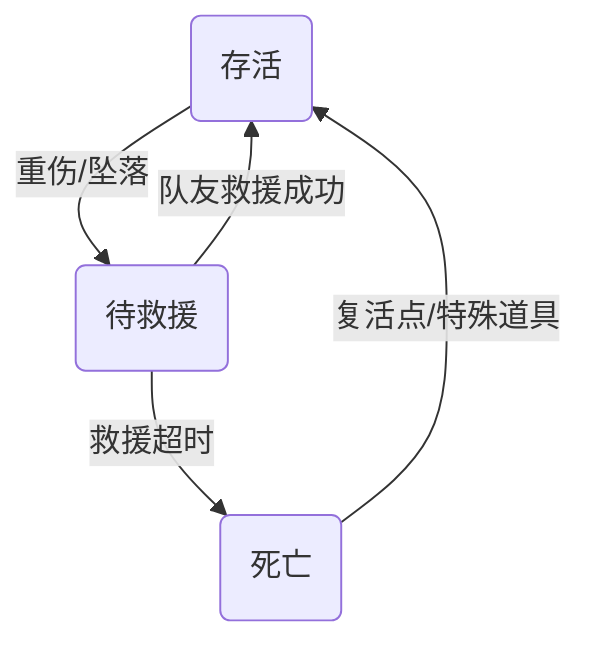

# 梦山 系统设计规范 — 状态系统 (State System Spec)

> **设计目的 (Design Goal)**
> *   **体验目标**: 通过「体力条 + 状态占段 + 生存状态」统一管理玩家的风险与安全感，让“互相救援、彼此减负”成为核心体验的一部分。
> *   **功能目标**: 定义体力/最大体力成长规则、Action_Bar 的各类状态占段，以及存活/待救援/死亡三种生存状态与道具、关卡、关系系统的对接。
> **设计支柱引用**: [互助即玩法](../00_项目核心/02_Pillars_设计支柱.md)
> **关联文档**: [攀爬与移动](攀爬与移动.md)、[协作与救援](协作与救援.md)、[关系系统](关系系统.md)、[道具系统](道具系统.md)
> **更新日期**: 2026-02-09

---

## 1. 体力与最大体力 (Stamina & Max Stamina)

### 1.1 体力条 (Action_Bar) 总览

*   **Action_Bar** 作为统一的「体力/行动资源条」，用于：
    * 攀爬体力消耗（见《攀爬与移动》）
    * 负重惩罚占段（见《道具系统》）
    * 环境与异常状态占段（冰冻、中毒、受伤等）
*   Action_Bar 以数值 `STAMINA_CURRENT / STAMINA_MAX` 表示当前可用体力，其中 `STAMINA_MAX` 会随游戏推进逐步提升。

### 1.2 最大体力成长

*   **基础上限**：新手期默认 `STAMINA_MAX_BASE`（例如 100 点），保障基础攀爬路线可行。
*   **成长来源**（示例，具体设计可在数值文档细化）：
    * 通过收集特定「体力羁绊/记忆碎片」类要素提升上限。
    * 完成关键协作节点后奖励「体力上限碎片」。
*   **成长规则**：
    * 最大体力 = `STAMINA_MAX_BASE + Σ(体力上限成长)`，成长步长、上限需在数值文档中配置。

### 1.3 PEAK 基础设计还原（参考）

*   **基础体力**：PEAK 中基础最大体力为 100 点；梦山以 `STAMINA_MAX_BASE = 100` 对齐，并保留上限成长。
*   **体力回复**：PEAK 中站立或行走时体力会回复；实现时可与此对齐（攀爬/奔跑中不回复或慢回复，由数值表配置）。
*   **占段颜色与 PEAK 对齐**：可用体力=绿、负重=棕、饥饿=黄、受伤=红、中毒=紫、寒冷=蓝；PEAK 另有 Heat（红）、Fatigue（粉）、Thorns/Drowsy/Curse 等，可按需扩展为额外占段类型。

---

## 2. 状态占段模型 (Segment Model)

参考 PEAK 的体力条分段设计，本游戏体力条由多种**彩色占段**组成，这些占段会减少可用体力（绿色部分），并通过道具或环境行为进行管理。

### 2.1 占段类型定义

| 占段类型 | 颜色建议 | 来源 | 作用 | 典型清除方式 |
| :--- | :--- | :--- | :--- | :--- |
| **可用体力 (Available Stamina)** | 绿色 | 无 | 玩家可用于奔跑、攀爬、攀爬跳跃等行为的体力部分 | 随自然回复/休整恢复上限内的可用体力 |
| **负重占段 (Weight_Penalty)** | 棕色/灰色 | 携带道具总重量 | 占据体力上限，使可用体力减少，但本身不会继续恶化 | 丢弃/转移道具，见《道具系统》 |
| **饥饿/疲劳占段** | 黄色/粉色 | 长时间行动、不进食、特定环境 | 长期行为带来的可用体力上限下降 | 进食/休息类道具或营地休整 |
| **受伤占段** | 红色 | 摔落伤害、攻击等 | 代表身体伤害，显著减少可用体力 | 绷带、急救包等治疗类道具 |
| **中毒占段** | 紫色 | 毒性环境、食物 | 持续侵蚀可用体力上限，可能叠加 | 解毒药等状态解除道具 |
| **寒冷占段** | 蓝色 | 寒冷环境、暴露 | 暂时降低可用体力上限，影响攀爬效率 | 抗冻剂、热源类道具或离开寒区 |

> **说明**：具体颜色与是否全部启用可根据美术与体验需要调整；本规范关注的是「占段逻辑」与「与道具/环境的对接」。

### 2.2 可用体力计算

*   统一公式：可用体力 = `STAMINA_MAX` − Σ(所有状态占段)
*   当可用体力 ≤ 0 时：禁止或削弱高消耗行为（奔跑、攀爬跳跃等），优先触发失败反馈（如打滑、动作中断），而非直接 Game Over。
*   各占段的具体数值变动由对应系统驱动：负重占段 ← 《道具系统》；受伤/中毒/寒冷等占段 ← 《环境与关卡》与敌人/陷阱系统触发。

---

## 3. 生存状态 (Alive / Downed / Dead)

参考 PEAK 的「倒地 → 待救援 → 死亡 → 复活点」机制，并结合本项目的互助体验，定义如下三种生存状态。

### 3.1 状态定义

| 状态码 | 名称 | 说明 |
| :--- | :--- | :--- |
| **0** | 存活 (Alive) | 正常行动中，Action_Bar 有可用体力，可进行攀爬、奔跑、使用道具等。 |
| **1** | 待救援 (Downed) | 体力条被特定原因（如重伤、坠落）击穿后进入的「倒地状态」，无法自主行动，需要队友救援。 |
| **2** | 死亡 (Dead) | 未在救援时限内获救，或在极端条件下直接死亡，需通过特定机制/复活点回归。 |

### 3.2 状态流转（示意）



### 3.3 进入待救援状态的条件

*   典型触发：摔落伤害超过某阈值（与高度、落地姿态等相关）；受到敌人/环境攻击，在受伤占段累积到临界点时。
*   进入待救援后：角色倒地或保持跪姿，仅允许**有限视角与通信/信号行为**（如呼救）；行为限制：无法攀爬、奔跑或使用大部分道具（是否允许自用药品可在道具系统中进一步约定）。

### 3.4 待救援阶段的协作与代价（参考 PEAK）

*   **背负救援**：队友可将待救援玩家扛在背上（类似 PEAK 中背负倒地队友），暂停其死亡计时器，但显著增加自身负重与操作难度；背负会增加 Weight_Penalty，占据背负者的体力槽，影响其攀爬效率，形成「救人有代价」的协作博弈。
*   **原地复苏**：队友在一定范围内可通过使用特定道具（如急救包、治疗包）或执行「救援动作」使待救援玩家回到存活状态；不同倒地原因可要求不同道具：如重伤 → 绷带/急救包；环境导致的昏厥 → 食物/热源/解毒类道具等。详见《协作与救援》。

### 3.5 死亡与复活

*   若待救援状态在限定时间内未获救，则进入**死亡 (Dead)** 状态：角色脱离当前实体，可采用「灵魂视角」/观战模式观测队友攀爬过程。
*   复活途径与检查点、营地/祭坛、稀有复活道具等由《进度与复活点》定义；本处仅定义存活/待救援/死亡三种状态及流转。

---

## 4. 数据结构示例 (Data Schema)

```typescript
/** 玩家状态数据 */
interface PlayerStateData {
    playerId: number;
    staminaCurrent: number;   // 当前可用体力
    staminaMax: number;       // 当前体力上限（含成长）
    weightPenalty: number;    // 负重占段
    hungerSegment: number;    // 饥饿/疲劳占段
    injurySegment: number;    // 受伤占段
    poisonSegment: number;    // 中毒占段
    coldSegment: number;      // 寒冷占段
    lifeState: LifeState;     // 0 存活 | 1 待救援 | 2 死亡
    downedTimer?: number;     // 待救援状态下剩余时间（秒）
}
enum LifeState { Alive = 0, Downed = 1, Dead = 2 }
```

---

## 5. 与其他系统的映射

| 系统 | 本规范覆盖 |
| :--- | :--- |
| **[SYS_STATE] 状态系统** | Action_Bar、体力上限成长、各类状态占段、生存状态流转 |
| **[SYS_ITEM] 道具系统** | 通过道具修改/清除各类占段（回复体力、解除中毒/寒冷/受伤）、复活类道具等 |
| **[SYS_CLIMB] 攀爬与移动** | 消耗可用体力进行攀爬/攀爬跳跃；可用体力不足时触发滑落/失败反馈 |
| **[SYS_COOP] 协作与救援** | 背负救援、原地复苏；详见《协作与救援》 |
| **[SYS_RELATION] 关系系统** | 救援/背负/复活行为可作为关系进展与信任度加成事件 |
| **[SYS_PROGRESS] 进度与复活点** | 复活途径、检查点；详见《进度与复活点》 |

---

## 6. 小结

*   状态系统统一管理「体力上限成长 + 状态占段 + 生存状态」。
*   道具系统应专注于「物品类型、使用规则与效果」，其中效果通过增减本系统定义的各类占段或改变生存状态来体现。
*   关卡与环境系统通过施加占段与触发生存状态变化，将攀爬挑战转译为玩家可感知、可管理的风险框架。
