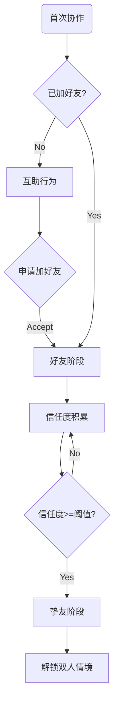

# 梦山 系统设计规范 — 关系系统 (Relation System Spec)

> **设计目的 (Design Goal)**
> *   **体验目标**: [Aes: Belonging] 支撑「陌生人→挚友」的关系沉淀，形成「固定的人一起玩」的长期锚点。
> *   **功能目标**: 管理玩家间的信任/挚友度，解锁双人/多人情境与权益。
> **设计支柱引用**: [双人/多人情境是长期锚点](../00_项目核心/02_Pillars_设计支柱.md)
> **更新日期**: 2026-02-07

---
## 1. 逻辑架构 (Logical Architecture)

### 1.1 核心对象 (Core Objects)
*   **关系 (Relation)**:
    *   **生命周期**: 首次互助 → 加好友 → 挚友/搭档 → [可选] 关系冷却/解除
    *   **关键属性**: 关系双方 ID、关系阶段、信任度/挚友度、解锁情境列表

*   **关系阶段 (Relation Stage)**:
    *   **陌生人**: 未加好友，仅单次/多次协作
    *   **好友**: 已加好友，可组队、查看状态
    *   **挚友/搭档**: 信任度达到阈值，解锁双人/多人情境

### 1.2 数据结构 (Data Schema)

```typescript
// 玩家关系数据
interface RelationData {
    id: string;              // 关系ID (playerA_id + playerB_id 有序)
    playerA: number;         // 玩家A ID
    playerB: number;         // 玩家B ID
    stage: RelationStage;    // 陌生人 | 好友 | 挚友
    trustValue: number;      // 信任度/挚友度
    unlockedSituations: number[];  // 已解锁的双人情境ID列表
    lastCooperateTime: number;     // 最近一次协作时间戳
}

enum RelationStage {
    Stranger = 0,
    Friend = 1,
    Buddy = 2   // 挚友/搭档
}
```

### 1.3 流程图 (Flowchart)



### 1.4 交互细节 (Interaction Design)
*   **操作方式**: 协作成功后可选「加好友」；挚友状态在 UI 中展示（搭档标识、可进入的双人情境入口）。
*   **反馈表现**:
    *   **视觉**: 关系阶段图标、信任度进度条、解锁情境的入场动画
    *   **听觉**: 加好友/成为挚友时的提示音
    *   **触觉**: [可选] 成为挚友时的震动反馈

---
## 2. 原子规则 (Atomic Rules)

### 规则 1: 互助产生信任度
*   **级别**: **必须 (MUST)**
*   **触发**: 托举/拉拽等协作成功
*   **检查**: 双方均为玩家（非 NPC）；协作节点有效
*   **执行**: 双方关系信任度 +{{TRUST_PER_COOP}}；更新 lastCooperateTime
*   **反馈**: 信任度增加动画/数字飘字（若已加好友）
*   **异常**: 未加好友时，信任度可预积累但暂不展示；加好友后合并

### 规则 2: 信任度达阈值解锁挚友
*   **级别**: **必须 (MUST)**
*   **触发**: 信任度达到 {{TRUST_THRESHOLD_BUDDY}}
*   **检查**: 双方已是好友
*   **执行**: stage 升级为 Buddy；解锁对应双人情境入口
*   **反馈**: 挚友解锁演出、情境入口高亮
*   **异常**: 若一方解除好友，挚友状态与情境权益失效

### 规则 3: 挚友解锁双人情境
*   **级别**: **必须 (MUST)**
*   **触发**: 进入双人/多人情境
*   **检查**: 双方为挚友；情境已解锁；双方在线
*   **执行**: 进入情境实例；消耗入场资格（若设计需要）
*   **反馈**: 情境加载、双人演出
*   **异常**: 对方离线时提示「等待搭档上线」

---
## 3. 依赖与接口 (Dependencies)

### 3.1 外部依赖
*   依赖 **[协作系统]**: 协作成功事件 `OnCooperateSuccess(playerA, playerB, coopType)`
*   依赖 **[双人情境]**: 情境解锁条件检查 `CanEnterSituation(relationId, situationId)`

### 3.2 对外接口
*   提供给 **[匹配系统]**: `GetBuddyList(playerId)` — 获取挚友列表用于组队
*   提供给 **[情境系统]**: `IsBuddy(playerA, playerB)` — 检查是否挚友
*   提供给 **[UI]**: `GetRelationStage(playerA, playerB)` — 展示关系状态

---
## 4. 内容需求 (Content Requirements)

### 4.1 配置表 (Config Tables)

**表名**: `RelationStage`

| 字段名 | 类型 | 分类 | 说明 | 验证规则 |
| :--- | :--- | :--- | :--- | :--- |
| ID | int | 🔑 Key | 阶段ID | Unique, >0 |
| StageName | string | 📝 Text | 阶段名称键 | Ref(Localization) |
| TrustReq | int | 🔢 Num | 所需信任度 | >=0 |
| UnlockSituations | int[] | 🔢 Num | 解锁情境ID列表 | Ref(Situation) |

**表名**: `TrustConfig`

| 字段名 | 类型 | 分类 | 说明 | 验证规则 |
| :--- | :--- | :--- | :--- | :--- |
| CoopType | string | 🔑 Key | 协作类型 | 托举/拉拽/借力 |
| TrustGain | int | 🔢 Num | 单次信任度增加 | >0 |

### 4.2 数值常量表 (Numeric Constants)

| 变量名 | 默认值 | 说明 |
| :--- | :--- | :--- |
| {{TRUST_PER_COOP}} | 10 | 单次协作成功增加的信任度 |
| {{TRUST_THRESHOLD_BUDDY}} | 100 | 成为挚友所需信任度 |
| {{MAX_TRUST}} | 999 | 信任度上限 |

---
## 5. 异常与边界 (Edge Cases)

| 场景 | 预期行为 | 错误码 |
| :--- | :--- | :--- |
| 断网重连 | 重新拉取关系数据，保持本地缓存 | - |
| 对方解除好友 | 挚友状态降级为陌生人，情境权益收回 | - |
| 重复加好友 | 忽略，保持好友状态 | - |
| 信任度溢出 |  cap 在 {{MAX_TRUST}} | - |
