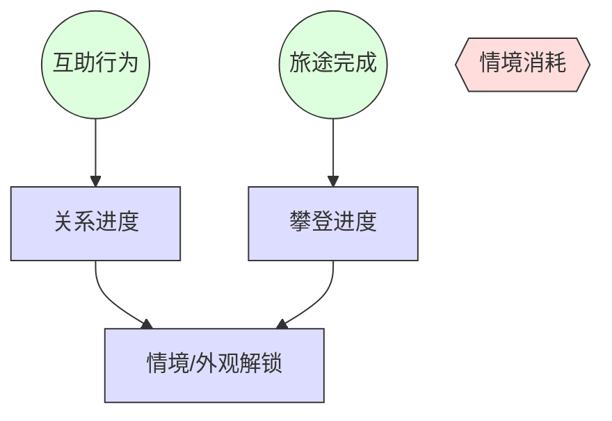

# 梦山 数值设计综述 (Numerics Design Overview)

> **设计原则**: 数值服务于体验。攀爬与协作数值服务于「手感、节奏、归属感」，不引入 Pay-to-Win 或抑制利他行为的成本。
> **前置依赖**: [00_项目核心](../00_项目核心/00_核心概念.md)、[系统设计规范_关系系统](../03_系统设计/系统设计规范_关系系统.md)、[核心玩法规范_攀爬与协作](../03_系统设计/核心玩法规范_攀爬与协作.md)
> **设计支柱引用**: [情感优先于数值](../00_项目核心/02_Pillars_设计支柱.md)、[ResourceFlow 资源流](../00_项目核心/04_ResourceFlow_资源流.md)

---

## 1. 概述 / Overview

本数值设计规范定义梦山项目核心玩法（攀爬、协作、关系）相关的数值模型、公式与配置表结构。所有数值**必须**服务于「旅途攀爬 → 互助协作 → 结识挚友 → 双人情境」的体验闭环，且**禁止**通过付费获得攀爬/协作数值优势。

---

## 2. 核心体验量化 (Quantified Aesthetics)

### 2.1 体验指标映射
*   **体验目标**: 攀爬手感可靠、协作反馈明确、关系进度可感知、利他行为有正向回报。
*   **监控指标** (待补充):
    *   攀爬操作响应延迟: 目标 < {{RESPONSE_MS}} ms
    *   协作成功反馈时长: 目标 {{COOP_FEEDBACK_MS}} ms 内
    *   单次协作信任度增益: {{TRUST_PER_COOP}}（引用关系系统）
    *   挚友阈值: {{TRUST_THRESHOLD_BUDDY}}

### 2.2 边界定义
*   **最小数值**: [待补充]
*   **最大数值**: 信任度 cap 为 {{MAX_TRUST}}；[其他待补充]

---

## 3. 资源流转模型 (Resource Flow)

> 引用 [04_ResourceFlow_资源流](../00_项目核心/04_ResourceFlow_资源流.md)

### 3.1 数值规则 (MUST)
*   **规则**: 互助行为**必须**产出关系进度；单次协作成功双方**必须**获得信任度增益。
*   **规则**: 经济资源（若存在）**必须**仅用于外观、便捷与非核心体验；**禁止**用于购买攀爬/协作数值优势。

#### 场景: 协作成功产生信任度
*   **当 / WHEN** 玩家 A 与 B 完成一次托举/拉拽/借力协作
*   **则 / THEN** 双方关系信任度 +{{TRUST_PER_COOP}}
*   **且 / AND** 若已达挚友阈值，解锁对应双人情境

---

## 4. 攀爬与协作数值 (Climb & Coop Numerics)

### 4.1 攀爬手感参数 (待补充)
| 参数名 | 占位符 | 说明 | 验证规则 |
| :--- | :--- | :--- | :--- |
| 支点吸附范围 | {{GRIP_RANGE}} | 米 | >0 |
| 借力冲量系数 | {{BOOST_FORCE}} | 物理参数 | [待补充] |
| 协作有效范围 | {{COOP_RANGE_M}} | 米 | 引用关卡规范 |

### 4.2 协作数值
*   引用 [系统设计规范_关系系统](../03_系统设计/系统设计规范_关系系统.md) 中 TrustConfig、RelationStage 表。

---

## 5. 配置表索引 (Config Table Index)

| 表名 / Table | 路径 / Path | 说明 / Description |
| :--- | :--- | :--- |
| RelationStage | `excel/relation/RelationStage.xlsx` | 关系阶段与信任阈值 |
| TrustConfig | `excel/relation/TrustConfig.xlsx` | 协作类型与信任度增益 |
| [待补充] | - | 攀爬/关卡相关参数 |

---

## 6. 模拟与验证 (Simulation)

### 6.1 模拟需求 (待补充)
*   **场景**: 关系进度积累曲线模拟；挚友达成时长分布。
*   **脚本需求**: [待补充]

### 6.2 验收标准
*   **规则**: 同条件下协作成功**必须**产生预期信任度增益；挚友解锁**必须**符合阈值逻辑。

---

## 7. 占位说明

本文档为 GameSpec 规范下的占位文档。待后续补充：
*   攀爬物理与手感参数的具体数值与公式
*   关卡难度曲线与节奏参数
*   经济生态（若引入外观/便捷付费）的阶层模型与通胀控制
*   模拟脚本与验收数据

---

*符合 GameSpec 数值设计文档规范 v1.0*
